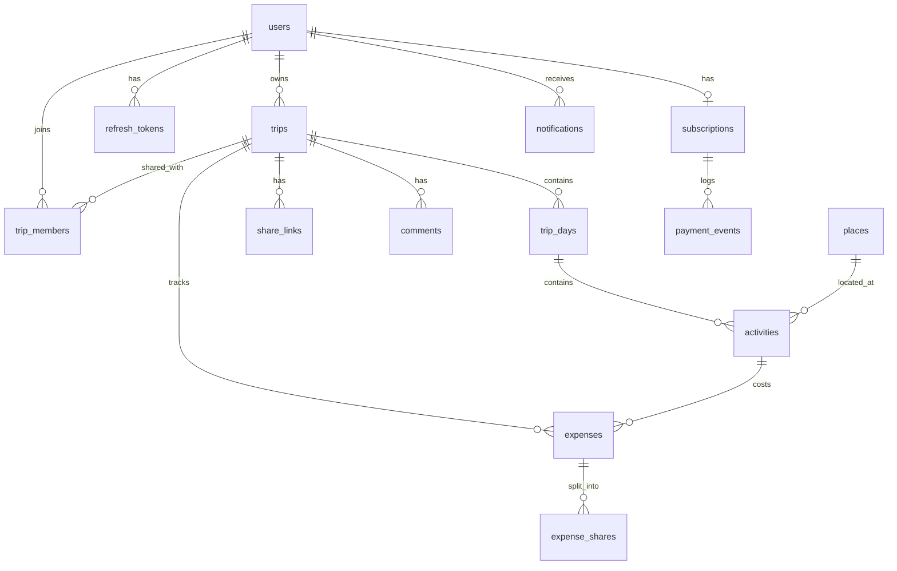

# Smart Trip Planner — Design Document

> Tài liệu thiết kế kỹ thuật. Mọi quyết định trong file này là **nguồn sự thật duy nhất** cho việc implement.
> Phiên bản: 1.0 — Mục tiêu: sản phẩm portfolio cho vị trí Backend / Fullstack Java.

---

## 1. Tổng quan

### 1.1. Mô tả

Smart Trip Planner là web app giúp người dùng lên kế hoạch cho một chuyến đi: tạo chuyến đi theo khoảng ngày, thêm hoạt động cho từng ngày, gắn địa điểm lên bản đồ, xem dự báo thời tiết cho từng ngày, mời bạn bè cùng chỉnh sửa theo thời gian thực, theo dõi chi phí, và nâng cấp Premium để mở khoá các giới hạn.

### 1.2. Vì sao đề tài này tốt cho CV

| Điểm kỹ thuật | Thể hiện ở đâu trong dự án |
|---|---|
| Authorization phức tạp (không chỉ role) | Owner / Editor / Viewer / public link trên từng resource |
| Tích hợp third-party + chống phụ thuộc | Provider abstraction, circuit breaker, cache |
| Xử lý thanh toán an toàn | Stripe webhook + idempotency + reconciliation |
| Real-time | WebSocket STOMP cho đồng chỉnh sửa lịch trình |
| Hiệu năng | Redis cache, rate limiting, N+1 query optimization |
| Kỹ thuật vận hành | Docker, CI/CD, Flyway, test coverage, structured logging |

### 1.3. Đối tượng người dùng

| Actor | Mô tả |
|---|---|
| Guest | Chưa đăng nhập. Chỉ xem được trip qua public share link. |
| User (FREE) | Đầy đủ chức năng nhưng bị giới hạn hạn mức. |
| User (PREMIUM) | Bỏ giới hạn, mở khoá AI suggest, export PDF, weather alert. |
| Admin | Quản lý user, xem thống kê, xem log thanh toán. |

---

## 2. Phạm vi (Scope)

### 2.1. In scope — Phase 1 → 4

- Auth: đăng ký, đăng nhập, refresh token, verify email, quên/đặt lại mật khẩu
- Quản lý chuyến đi: CRUD, clone, archive, soft delete
- Lịch trình: TripDay tự sinh, Activity CRUD + reorder + validate trùng giờ
- Địa điểm: search (mock → OSM), lưu snapshot, hiển thị bản đồ, tính khoảng cách giữa các điểm
- Thời tiết: forecast theo ngày của trip, cache Redis, cảnh báo hoạt động ngoài trời
- Chia sẻ: mời theo email với role EDITOR/VIEWER, public share link có thể thu hồi
- Real-time: đồng chỉnh sửa activity qua WebSocket, presence (ai đang xem trip)
- Chi phí: ghi nhận expense, tổng hợp theo ngày/trip, chia tiền giữa thành viên
- Premium: Stripe Checkout, webhook, Customer Portal, feature gating
- AI: gợi ý lịch trình cho một điểm đến + số ngày (chỉ Premium)
- Notification: in-app + email bất đồng bộ
- Admin: thống kê, khoá/mở user, xem payment event

### 2.2. Out of scope (ghi rõ để không bị scope creep)

- Đặt vé máy bay / khách sạn thật
- Thanh toán nội địa (VNPay/MoMo) — Stripe test mode là đủ
- Mobile app native
- Dịch đa ngôn ngữ toàn bộ UI (chỉ chuẩn bị sẵn cấu trúc i18n cho message backend)
- Offline mode

---

## 3. Tech Stack

### 3.1. Backend

| Thành phần | Lựa chọn | Lý do |
|---|---|---|
| Language | Java 21 | Record, pattern matching, virtual thread cho @Async |
| Framework | Spring Boot 4.1.x | Spring Framework 7, Jakarta EE 11, Jackson 3 |
| Security | Spring Security 7 + JJWT 0.12+ | Access token + refresh token |
| Persistence | Spring Data JPA (Hibernate 7) | |
| Database | MySQL 8.0 | |
| Migration | Flyway | Versioned SQL. Hibernate `ddl-auto: validate` ở mọi môi trường (kể cả test), schema chỉ do Flyway tạo |
| Cache / rate limit | Redis 7 + Spring Data Redis + Bucket4j | |
| Realtime | Spring WebSocket + STOMP | |
| Mapping | MapStruct 1.6 | Entity ↔ DTO, compile-time |
| Boilerplate | Lombok | |
| Validation | Jakarta Bean Validation (Hibernate Validator) | |
| API Docs | springdoc-openapi 3.1.x | Dòng 3.1 build trên Spring Boot 4.1. Không nằm trong BOM của Boot → khai báo version ở `libs.versions.toml`. Swagger UI tại `/swagger-ui.html` |
| Payment | Stripe Java SDK | |
| Resilience | Resilience4j | Circuit breaker + retry cho provider ngoài |
| Test | JUnit 5, Mockito, AssertJ, Testcontainers, Rest Assured | |
| Coverage | JaCoCo (ngưỡng 70% line cho package `service`) | |
| Build | Gradle 9 (Groovy DSL — `build.gradle`) | Spring Boot 4 hỗ trợ Gradle 8.14+, khuyến nghị Gradle 9 |

> **Lưu ý Gradle — thứ tự annotation processor.** Lombok và MapStruct phải khai báo đúng thứ tự, nếu không MapStruct sẽ sinh mapper rỗng vì không thấy getter/setter do Lombok tạo:
>
> ```groovy
> dependencies {
>     compileOnly 'org.projectlombok:lombok'
>     annotationProcessor 'org.projectlombok:lombok'
>     annotationProcessor 'org.projectlombok:lombok-mapstruct-binding:0.2.0'
>     implementation 'org.mapstruct:mapstruct:1.6.3'
>     annotationProcessor 'org.mapstruct:mapstruct-processor:1.6.3'
>
>     testCompileOnly 'org.projectlombok:lombok'
>     testAnnotationProcessor 'org.projectlombok:lombok'
> }
> ```
>
> Thứ tự bắt buộc: `lombok` → `lombok-mapstruct-binding` → `mapstruct-processor`.

### 3.2. Frontend

| Thành phần | Lựa chọn |
|---|---|
| Framework | React 18 + Vite + TypeScript |
| Styling | TailwindCSS + shadcn/ui |
| Server state | TanStack Query v5 |
| Client state | Zustand |
| Routing | React Router v6 |
| Form | react-hook-form + zod |
| Map | Leaflet + react-leaflet + OpenStreetMap tiles (free, không cần API key) |
| Realtime | @stomp/stompjs + sockjs-client |
| HTTP | axios + interceptor tự refresh token |
| Drag & drop | dnd-kit |
| Chart | recharts (trang expense + admin dashboard) |

### 3.3. Infrastructure

| Thành phần | Lựa chọn |
|---|---|
| Container | Docker + docker-compose (mysql, redis, backend, frontend-nginx, mailhog) |
| CI | GitHub Actions: build → test → jacoco report → build image → push GHCR |
| CD | Deploy VPS qua SSH + docker compose pull/up (hoặc Railway/Render nếu không có VPS) |
| Reverse proxy | Nginx (serve static frontend + proxy `/api` sang backend) |
| TLS | Let's Encrypt qua Certbot / Cloudflare |
| Mail (dev) | MailHog — xem mail tại `localhost:8025` |
| Mail (prod) | Brevo / Resend SMTP free tier |

---

## 4. Kiến trúc

### 4.1. Sơ đồ tầng

```
┌────────────────────────────────────────────────────────────┐
│  React SPA (Vite)                                          │
└───────────────┬───────────────────────┬────────────────────┘
                │ REST /api/v1          │ WebSocket /ws
┌───────────────▼───────────────────────▼────────────────────┐
│  Controller layer   (validate input, trả ApiResponse)      │
├────────────────────────────────────────────────────────────┤
│  Service layer      (business rule, @Transactional, quota) │
├──────────────┬──────────────────────┬──────────────────────┤
│ Repository   │ Provider (port)      │ Publisher (WS/Event) │
│  (JPA)       │  Map/Weather/Pay/AI  │                      │
├──────────────┼──────────────────────┼──────────────────────┤
│   MySQL      │ Mock impl / Real impl│   Redis              │
└──────────────┴──────────────────────┴──────────────────────┘
```

**Quy tắc bắt buộc:**
- Controller **không** chứa business logic, **không** nhận/trả Entity.
- Service **không** biết tới `HttpServletRequest`, `ResponseEntity`.
- Repository **không** gọi Service.
- Entity **không bao giờ** rời khỏi tầng service (luôn map sang DTO).

### 4.2. Cấu trúc package

```
com.trieu.tripplanner
├── TripPlannerApplication.java
├── common
│   ├── ApiResponse.java              // envelope thành công
│   ├── ErrorResponse.java            // envelope lỗi
│   ├── PageResponse.java
│   ├── constant/                     // AppConstants, CacheNames, ErrorCode
│   └── util/                         // DateUtils, SlugUtils, TokenUtils, GeoUtils
├── config
│   ├── SecurityConfig.java
│   ├── JwtConfig.java
│   ├── RedisConfig.java
│   ├── CacheConfig.java
│   ├── WebSocketConfig.java
│   ├── OpenApiConfig.java
│   ├── AsyncConfig.java
│   ├── CorsConfig.java
│   └── properties/                   // @ConfigurationProperties: AppProperties, StripeProperties...
├── security
│   ├── JwtTokenProvider.java
│   ├── JwtAuthenticationFilter.java
│   ├── CustomUserDetails.java
│   ├── CustomUserDetailsService.java
│   ├── RestAuthenticationEntryPoint.java
│   ├── RestAccessDeniedHandler.java
│   └── permission/
│       ├── TripPermissionEvaluator.java
│       └── annotation/@CanEditTrip, @CanViewTrip
├── exception
│   ├── GlobalExceptionHandler.java
│   ├── AppException.java             // base, chứa ErrorCode
│   ├── ResourceNotFoundException.java
│   ├── BusinessRuleException.java
│   ├── QuotaExceededException.java
│   └── PaymentException.java
├── model                             // JPA entities
│   ├── BaseEntity.java               // id, createdAt, updatedAt
│   ├── AuditableEntity.java          // + createdBy, updatedBy
│   └── enums/
├── repository
├── dto
│   ├── request/
│   ├── response/
│   └── internal/                     // record dùng nội bộ giữa các service
├── mapper                            // MapStruct
├── service
│   ├── AuthService / UserService
│   ├── TripService / TripDayService / ActivityService
│   ├── PlaceService / WeatherService
│   ├── SharingService / CommentService
│   ├── ExpenseService
│   ├── SubscriptionService / StripeWebhookService
│   ├── AiItineraryService
│   ├── NotificationService / MailService
│   └── AdminService
├── provider                          // ★ tầng chống phụ thuộc third-party
│   ├── map/     MapProvider, MockMapProvider, OsmMapProvider
│   ├── weather/ WeatherProvider, MockWeatherProvider, OpenMeteoWeatherProvider
│   ├── payment/ PaymentProvider, MockPaymentProvider, StripePaymentProvider
│   ├── ai/      AiProvider, MockAiProvider, ClaudeAiProvider
│   └── storage/ StorageProvider, LocalStorageProvider, CloudinaryStorageProvider
├── controller
│   └── admin/
├── websocket
│   ├── TripCollabController.java     // @MessageMapping
│   ├── WebSocketAuthInterceptor.java
│   └── event/                        // ActivityChangedEvent, PresenceEvent
└── scheduler
    ├── TripReminderScheduler.java
    └── SubscriptionSyncScheduler.java
```

Frontend:

```
src
├── api/            // axios client, endpoint theo module
├── components/     // ui/ (shadcn), common/, map/, trip/
├── features/
│   ├── auth/  trips/  itinerary/  sharing/  expense/  billing/  admin/
├── hooks/
├── layouts/
├── pages/
├── stores/         // zustand: authStore, tripCollabStore
├── types/          // sinh từ OpenAPI schema
└── lib/            // formatters, guards, constants
```

---

## 5. Data Model

### 5.1. ERD



### 5.2. Chi tiết bảng

#### `users`
| Cột | Kiểu | Ghi chú |
|---|---|---|
| id | BIGINT PK AI | |
| email | VARCHAR(255) | UNIQUE, lowercase |
| password_hash | VARCHAR(255) | BCrypt strength 12 |
| full_name | VARCHAR(120) | |
| avatar_url | VARCHAR(512) | nullable |
| timezone | VARCHAR(64) | default `Asia/Ho_Chi_Minh` |
| locale | VARCHAR(10) | default `vi` |
| role | ENUM | `USER`, `ADMIN` |
| plan | ENUM | `FREE`, `PREMIUM` |
| plan_expires_at | DATETIME | nullable |
| email_verified | BOOLEAN | default false |
| status | ENUM | `ACTIVE`, `BLOCKED` |
| created_at / updated_at | DATETIME | |
| deleted_at | DATETIME | soft delete |

Index: `idx_users_email(email)`, `idx_users_plan(plan)`

#### `refresh_tokens`
| Cột | Kiểu | Ghi chú |
|---|---|---|
| id | BIGINT PK | |
| user_id | BIGINT FK | |
| token_hash | CHAR(64) | SHA-256, **không lưu token thô** |
| expires_at | DATETIME | |
| revoked_at | DATETIME | nullable |
| user_agent / ip_address | VARCHAR | phục vụ màn "thiết bị đăng nhập" |

#### `verification_tokens`
`id, user_id, token_hash, type ENUM(EMAIL_VERIFY, PASSWORD_RESET), expires_at, used_at`

#### `trips`
| Cột | Kiểu | Ghi chú |
|---|---|---|
| id | BIGINT PK | |
| owner_id | BIGINT FK users | |
| title | VARCHAR(160) | |
| slug | VARCHAR(200) | unique, dùng cho public URL |
| description | TEXT | |
| cover_image_url | VARCHAR(512) | |
| destination_name | VARCHAR(200) | |
| destination_lat / lng | DECIMAL(10,7) / DECIMAL(10,7) | |
| start_date / end_date | DATE | end >= start, tối đa 60 ngày |
| budget_amount | DECIMAL(15,2) | nullable |
| currency | CHAR(3) | default `VND` |
| status | ENUM | `DRAFT`, `PLANNED`, `ONGOING`, `COMPLETED`, `ARCHIVED` |
| visibility | ENUM | `PRIVATE`, `LINK`, `PUBLIC` |
| created_at / updated_at / deleted_at | | |

Index: `idx_trips_owner_status(owner_id, status)`, `idx_trips_slug(slug)`

#### `trip_days`
`id, trip_id FK, day_index INT, date DATE, title VARCHAR(160), note TEXT`
UNIQUE `(trip_id, date)` — sinh tự động khi tạo/đổi ngày trip.

#### `activities`
| Cột | Kiểu | Ghi chú |
|---|---|---|
| id | BIGINT PK | |
| trip_day_id | BIGINT FK | |
| place_id | BIGINT FK places | nullable |
| title | VARCHAR(200) | |
| type | ENUM | `SIGHTSEEING`, `FOOD`, `TRANSPORT`, `ACCOMMODATION`, `SHOPPING`, `OTHER` |
| start_time / end_time | TIME | nullable, end > start |
| order_index | INT | dùng cho drag-drop |
| note | TEXT | |
| cost_amount | DECIMAL(15,2) | |
| currency | CHAR(3) | |
| booking_url | VARCHAR(512) | |
| created_by | BIGINT FK users | phục vụ realtime & audit |

Index: `idx_activities_day_order(trip_day_id, order_index)`

#### `places`
`id, provider ENUM(MOCK, OSM, GOOGLE, MANUAL), external_id VARCHAR(128), name, address, lat, lng, category, photo_url, rating DECIMAL(2,1), raw_json JSON, created_at`
UNIQUE `(provider, external_id)` — **snapshot** để hiển thị lại không cần gọi API.

#### `trip_members`
| Cột | Ghi chú |
|---|---|
| id, trip_id FK, user_id FK (nullable) | nullable khi mời email chưa có tài khoản |
| invited_email VARCHAR(255) | |
| role ENUM | `OWNER`, `EDITOR`, `VIEWER` |
| status ENUM | `PENDING`, `ACCEPTED`, `DECLINED`, `REMOVED` |
| invited_by, invited_at, accepted_at | |

UNIQUE `(trip_id, user_id)`, UNIQUE `(trip_id, invited_email)`

#### `share_links`
`id, trip_id FK, token CHAR(32) UNIQUE, permission ENUM(VIEW, EDIT), expires_at, revoked_at, view_count INT, created_by, created_at`

#### `comments`
`id, trip_id FK, activity_id FK nullable, user_id FK, parent_id FK self nullable, content TEXT, created_at, deleted_at`

#### `expenses`
`id, trip_id FK, activity_id FK nullable, paid_by_user_id FK, title, amount DECIMAL(15,2), currency CHAR(3), category ENUM, spent_at DATE, note`

#### `expense_shares`
`id, expense_id FK, user_id FK, amount DECIMAL(15,2)` — tổng amount phải bằng expense.amount.

#### `subscriptions`
`id, user_id FK UNIQUE, provider, provider_customer_id, provider_subscription_id, plan_code ENUM(PREMIUM_MONTHLY, PREMIUM_YEARLY), status ENUM(ACTIVE, PAST_DUE, CANCELED, INCOMPLETE), current_period_start, current_period_end, cancel_at_period_end BOOLEAN`

#### `payment_events`
`id, provider, event_id VARCHAR(255) UNIQUE, type, payload_json JSON, status ENUM(RECEIVED, PROCESSED, FAILED), processed_at, error_message`
→ **UNIQUE trên `event_id` chính là cơ chế idempotency.**

#### `notifications`
`id, user_id FK, type ENUM, title, message, link, read_at, created_at`

#### `ai_suggestion_logs`
`id, user_id FK, trip_id FK nullable, prompt_hash CHAR(64), model, tokens_used INT, latency_ms INT, created_at`
→ dùng cho rate limit AI và cache theo `prompt_hash`.

---

## 6. Security & Authorization

### 6.1. Token

| | Access Token | Refresh Token |
|---|---|---|
| Dạng | JWT (HS256) | Chuỗi random 64 ký tự |
| TTL | 15 phút | 7 ngày |
| Lưu ở client | memory (Zustand) | httpOnly cookie |
| Lưu ở server | không | hash SHA-256 trong DB |
| Revoke | không (TTL ngắn) | có, qua `revoked_at` |

Claims: `sub` (userId), `email`, `role`, `plan`, `iat`, `exp`, `jti`.

**Rotation:** mỗi lần gọi `/auth/refresh` → revoke token cũ, phát token mới. Nếu nhận refresh token đã bị revoke → coi là token theft, revoke **toàn bộ** token của user đó.

### 6.2. Ma trận quyền trên Trip

| Hành động | OWNER | EDITOR | VIEWER | Link VIEW | Link EDIT | Guest |
|---|:--:|:--:|:--:|:--:|:--:|:--:|
| Xem trip | ✅ | ✅ | ✅ | ✅ | ✅ | ❌ |
| Sửa thông tin trip | ✅ | ✅ | ❌ | ❌ | ❌ | ❌ |
| Xoá trip | ✅ | ❌ | ❌ | ❌ | ❌ | ❌ |
| CRUD activity | ✅ | ✅ | ❌ | ❌ | ✅ | ❌ |
| Comment | ✅ | ✅ | ✅ | ❌ | ❌ | ❌ |
| Mời / gỡ thành viên | ✅ | ❌ | ❌ | ❌ | ❌ | ❌ |
| Tạo / thu hồi share link | ✅ | ❌ | ❌ | ❌ | ❌ | ❌ |
| Quản lý expense | ✅ | ✅ | ❌ | ❌ | ❌ | ❌ |
| Export PDF | ✅(Premium) | ❌ | ❌ | ❌ | ❌ | ❌ |

Implement bằng `TripPermissionEvaluator` + annotation tuỳ biến:

```java
@PreAuthorize("@tripPermission.canEdit(#tripId, principal)")
```

Kết quả quyền của (userId, tripId) được **cache Redis TTL 5 phút**, evict khi thay đổi membership.

### 6.3. Checklist bảo mật

- BCrypt strength 12, không log password/token
- Rate limit login: 5 lần / 15 phút / IP+email → trả 429
- CORS whitelist theo env, không dùng `*` khi có credentials
- Stripe webhook verify signature bằng `Webhook.constructEvent`
- Validate mọi input; chống mass assignment bằng cách chỉ dùng request DTO
- JPA parameter binding (không nối chuỗi query)
- Escape output ở frontend (React mặc định an toàn, không dùng `dangerouslySetInnerHTML`)
- Secret nằm ở biến môi trường, `.env` trong `.gitignore`, có `.env.example`
- Actuator chỉ expose `health`, `info`; các endpoint khác yêu cầu ADMIN

---

## 7. Provider Abstraction (mock trước, thật sau)

### 7.1. Nguyên tắc

Mọi dịch vụ ngoài đều nằm sau một interface trong `provider/`. Chọn implementation bằng config, **không sửa service code khi chuyển từ mock sang thật**.

```yaml
app:
  providers:
    map: mock        # mock | osm
    weather: mock    # mock | open-meteo
    payment: mock    # mock | stripe
    ai: mock         # mock | claude
    storage: local   # local | cloudinary
```

```java
@Service
@ConditionalOnProperty(name = "app.providers.weather", havingValue = "mock")
public class MockWeatherProvider implements WeatherProvider { ... }
```

### 7.2. Các port

| Interface | Method chính | Mock trả về | Real impl |
|---|---|---|---|
| `MapProvider` | `search(String q, int limit)`, `reverse(lat,lng)`, `distanceMatrix(List<Coord>)` | Dataset JSON ~200 địa điểm VN trong `resources/mock/places.json` | Nominatim/OSRM (OSM, free) hoặc Google Places |
| `WeatherProvider` | `forecast(lat, lng, LocalDate from, LocalDate to)` | Sinh giả lập theo seed = hash(lat,lng,date) → **kết quả ổn định**, test được | Open-Meteo (free, không cần key) |
| `PaymentProvider` | `createCheckoutSession`, `createPortalSession`, `parseWebhook` | Trả về URL giả `/mock-checkout?session=xxx` kích hoạt Premium ngay | Stripe |
| `AiProvider` | `suggestItinerary(AiItineraryRequest)` | Trả về lịch trình mẫu theo template | Claude API |
| `StorageProvider` | `upload(file)`, `delete(key)` | Ghi vào thư mục `uploads/` local | Cloudinary |

### 7.3. Resilience

Mọi real provider bọc trong Resilience4j:
- `@CircuitBreaker` — mở khi tỉ lệ lỗi > 50% trong 20 lần gọi
- `@Retry` — 2 lần, backoff 500ms, chỉ retry với lỗi 5xx/timeout
- `@TimeLimiter` — 3 giây
- Fallback: trả dữ liệu cache cũ (stale-while-error), hoặc trả `WeatherUnavailable` thay vì ném lỗi làm hỏng cả màn hình trip

---

## 8. Caching & Rate Limiting (Redis)

### 8.1. Cache key

| Cache name | Key | TTL | Evict khi |
|---|---|---|---|
| `place:search` | `place:search:{sha1(query)}:{limit}` | 24h | — |
| `weather:forecast` | `weather:{lat4},{lng4}:{date}` | 3h | — |
| `trip:detail` | `trip:detail:{tripId}` | 10 phút | mọi ghi lên trip/day/activity |
| `trip:permission` | `perm:{userId}:{tripId}` | 5 phút | thay đổi member/share |
| `ai:suggestion` | `ai:sugg:{promptHash}` | 7 ngày | — |
| `user:quota` | `quota:{userId}:{yyyyMMdd}` | hết ngày | — |

Làm tròn lat/lng về 4 chữ số thập phân (~11m) để tăng cache hit cho weather.

### 8.2. Rate limit (Bucket4j + Redis)

| Nhóm endpoint | FREE | PREMIUM | Guest/IP |
|---|---|---|---|
| `POST /auth/login` | — | — | 5 / 15 phút |
| `POST /auth/register` | — | — | 3 / giờ |
| `GET /places/search` | 60 / giờ | 300 / giờ | 20 / giờ |
| `GET /weather/**` | 100 / giờ | 500 / giờ | — |
| `POST /ai/suggest-itinerary` | 0 (403) | 10 / ngày | — |
| Toàn cục | 1000 / giờ | 3000 / giờ | 200 / giờ |

Response khi vượt: HTTP 429 + header `X-RateLimit-Remaining`, `X-RateLimit-Reset`.

---

## 9. Feature Gating: FREE vs PREMIUM

| Giới hạn | FREE | PREMIUM |
|---|---|---|
| Số trip đang hoạt động (khác ARCHIVED) | 3 | không giới hạn |
| Activity / ngày | 10 | không giới hạn |
| Thành viên được mời / trip | 2 | 20 |
| Share link đồng thời / trip | 1 | 10 |
| Upload ảnh cover | ❌ (dùng ảnh mặc định) | ✅ |
| AI gợi ý lịch trình | ❌ | ✅ 10 lần/ngày |
| Export PDF / ICS | ❌ | ✅ |
| Weather alert qua email | ❌ | ✅ |
| Lịch sử phiên bản trip | ❌ | ✅ 30 ngày |

Kiểm tra tập trung ở `QuotaService`:

```java
quotaService.assertCanCreateTrip(userId);   // ném QuotaExceededException → HTTP 402
```

HTTP 402 Payment Required + `errorCode: QUOTA_EXCEEDED` + `upgradeUrl` để frontend hiện modal nâng cấp.

---

## 10. API Design

### 10.1. Quy ước chung

- Base path: `/api/v1`
- Hai envelope tách riêng, mỗi loại là **một record riêng** để tránh tạo response sai (ví dụ `success: true` kèm `errorCode`) và để OpenAPI schema / type TypeScript sinh bằng `gen:api` chính xác:
  - Thành công → `ApiResponse<T>` (4 field: `success`, `data`, `message`, `timestamp`). Controller luôn bọc kết quả trong record này.
  - Lỗi → `ErrorResponse` (6 field: `success`, `errorCode`, `message`, `details`, `timestamp`, `path`). Chỉ `GlobalExceptionHandler` tạo record này.

Thành công (`ApiResponse`):

```json
{
  "success": true,
  "data": { },
  "message": "OK",
  "timestamp": "2026-09-13T10:00:00Z"
}
```

Lỗi (`ErrorResponse`):

```json
{
  "success": false,
  "errorCode": "VALIDATION_ERROR",
  "message": "Dữ liệu không hợp lệ",
  "details": [
    { "field": "startDate", "message": "phải sau ngày hiện tại" }
  ],
  "timestamp": "2026-09-13T10:00:00Z",
  "path": "/api/v1/trips"
}
```

- `errorCode` luôn là một giá trị trong bảng 10.3. `details` chỉ có khi lỗi gắn với field cụ thể (validate), không có thì bị ẩn khỏi JSON.
- Response thành công không có dữ liệu (ví dụ `DELETE`) vẫn giữ `"data": null` để format ổn định.
- Lỗi 402 bổ sung field `upgradeUrl` vào `ErrorResponse` (mục 9) — thêm ở Phase 6.
- Message tiếng Việt lấy từ `messages.properties` theo `messageKey` của `ErrorCode`, không viết cứng trong code.

- Phân trang: `?page=0&size=20&sort=createdAt,desc` → `PageResponse<T>` gồm `items, page, size, totalElements, totalPages, hasNext`
- Ngày: ISO-8601. Giờ: `HH:mm`. Tiền: DECIMAL, không dùng float.

### 10.2. Danh sách endpoint

**Auth** `/api/v1/auth`
| Method | Path | Mô tả | Quyền |
|---|---|---|---|
| POST | `/register` | Đăng ký, gửi mail verify | Public |
| POST | `/login` | Trả access + set cookie refresh | Public |
| POST | `/refresh` | Xoay token | Cookie |
| POST | `/logout` | Revoke refresh token | Auth |
| POST | `/verify-email` | `{token}` | Public |
| POST | `/resend-verification` | | Auth |
| POST | `/forgot-password` | Gửi mail reset | Public |
| POST | `/reset-password` | `{token, newPassword}` | Public |

**User** `/api/v1/users`
| GET | `/me` | Thông tin + plan + quota hiện tại | Auth |
| PATCH | `/me` | Cập nhật profile | Auth |
| POST | `/me/avatar` | Upload ảnh (multipart) | Auth |
| PATCH | `/me/password` | Đổi mật khẩu | Auth |
| GET | `/me/sessions` | Danh sách refresh token đang sống | Auth |
| DELETE | `/me/sessions/{id}` | Đăng xuất thiết bị | Auth |

**Trip** `/api/v1/trips`
| GET | `` | Danh sách trip của tôi + trip được share, filter `status`, `q`, `from`, `to` | Auth |
| POST | `` | Tạo trip (tự sinh TripDay) | Auth + quota |
| GET | `/{id}` | Chi tiết đầy đủ (days + activities + members) | canView |
| PATCH | `/{id}` | Sửa. Nếu đổi ngày → reconcile TripDay | canEdit |
| DELETE | `/{id}` | Soft delete | owner |
| POST | `/{id}/clone` | Nhân bản | canView + quota |
| PATCH | `/{id}/status` | Đổi trạng thái | canEdit |
| GET | `/{id}/summary` | Tổng quan: số ngày, số activity, tổng chi phí, quãng đường | canView |
| GET | `/{id}/export?format=pdf\|ics` | Xuất file | owner + Premium |

**Itinerary** `/api/v1/trips/{tripId}`
| GET | `/days` | Danh sách ngày | canView |
| PATCH | `/days/{dayId}` | Sửa title/note | canEdit |
| GET | `/days/{dayId}/activities` | | canView |
| POST | `/days/{dayId}/activities` | Thêm activity | canEdit + quota |
| PATCH | `/activities/{activityId}` | Sửa | canEdit |
| DELETE | `/activities/{activityId}` | Xoá | canEdit |
| PUT | `/activities/reorder` | `[{activityId, dayId, orderIndex}]` — batch, 1 transaction | canEdit |
| GET | `/days/{dayId}/route` | Khoảng cách + thời gian giữa các activity theo thứ tự | canView |

**Place** `/api/v1/places`
| GET | `/search?q=&lat=&lng=&limit=` | Autocomplete, có cache | Auth |
| GET | `/{id}` | Chi tiết snapshot | Auth |
| POST | `/manual` | Tạo địa điểm thủ công | Auth |

**Weather** `/api/v1/weather`
| GET | `/forecast?lat=&lng=&from=&to=` | | Auth |
| GET | `/trips/{tripId}` | Forecast cho toàn bộ ngày của trip + cảnh báo | canView |

**Sharing** `/api/v1/trips/{tripId}`
| GET | `/members` | | canView |
| POST | `/members` | `{email, role}` → gửi mail mời | owner + quota |
| PATCH | `/members/{memberId}` | Đổi role | owner |
| DELETE | `/members/{memberId}` | Gỡ thành viên | owner |
| POST | `/members/accept` | `{inviteToken}` | Auth |
| POST | `/share-links` | `{permission, expiresAt}` | owner + quota |
| GET | `/share-links` | | owner |
| DELETE | `/share-links/{id}` | Thu hồi | owner |

Public: `GET /api/v1/public/trips/{shareToken}` — không cần auth.

**Comment** `/api/v1/trips/{tripId}/comments` — GET, POST, DELETE `/{id}`

**Expense** `/api/v1/trips/{tripId}/expenses`
| GET | `` | filter theo ngày/category | canView |
| POST | `` | `{title, amount, paidBy, shares[]}` | canEdit |
| PATCH/DELETE | `/{id}` | | canEdit |
| GET | `/summary` | Theo ngày, theo category, so với budget | canView |
| GET | `/settlement` | Ai nợ ai bao nhiêu (thuật toán tối giản giao dịch) | canView |

**Billing** `/api/v1/billing`
| GET | `/plans` | Danh sách gói + giá | Public |
| POST | `/checkout-session` | `{planCode}` → `{checkoutUrl}` | Auth |
| POST | `/portal-session` | → `{portalUrl}` | Auth + có subscription |
| GET | `/subscription` | Trạng thái hiện tại | Auth |
| POST | `/webhook` | Stripe gọi. **Bỏ qua CSRF + auth, verify signature** | Public |

**AI** `/api/v1/ai`
| POST | `/suggest-itinerary` | `{destination, days, interests[], pace, budgetLevel}` | Premium |
| POST | `/trips/{tripId}/apply-suggestion` | Ghi suggestion vào trip | canEdit + Premium |

**Notification** `/api/v1/notifications` — GET (phân trang), PATCH `/{id}/read`, PATCH `/read-all`, GET `/unread-count`

**Admin** `/api/v1/admin`
| GET | `/stats` | user mới, trip mới, MRR, tỉ lệ chuyển đổi Premium |
| GET | `/users` | Tìm kiếm, phân trang |
| PATCH | `/users/{id}/status` | Khoá/mở |
| GET | `/payment-events` | Log webhook, filter theo status |
| POST | `/payment-events/{id}/retry` | Xử lý lại event lỗi |

### 10.3. Bảng mã lỗi

| errorCode | HTTP | Ý nghĩa |
|---|---|---|
| `VALIDATION_ERROR` | 400 | Input sai |
| `UNAUTHORIZED` | 401 | Thiếu/hết hạn token |
| `TOKEN_EXPIRED` | 401 | Access token hết hạn (client tự refresh) |
| `FORBIDDEN` | 403 | Không đủ quyền trên resource |
| `EMAIL_NOT_VERIFIED` | 403 | |
| `RESOURCE_NOT_FOUND` | 404 | Không có resource, hoặc URL không tồn tại |
| `METHOD_NOT_ALLOWED` | 405 | Sai HTTP method (ví dụ `POST` vào endpoint chỉ có `GET`) |
| `EMAIL_ALREADY_EXISTS` | 409 | |
| `ACTIVITY_TIME_CONFLICT` | 409 | Trùng giờ trong cùng ngày |
| `STALE_VERSION` | 409 | Optimistic lock: dữ liệu đã bị người khác sửa (mục 11.3) |
| `QUOTA_EXCEEDED` | 402 | Vượt hạn mức gói FREE |
| `PREMIUM_REQUIRED` | 402 | Tính năng chỉ dành cho Premium |
| `RATE_LIMIT_EXCEEDED` | 429 | |
| `PROVIDER_UNAVAILABLE` | 503 | Third-party lỗi |
| `PAYMENT_FAILED` | 502 | |
| `INTERNAL_ERROR` | 500 | Mọi lỗi không lường trước. Log full stacktrace, **không** trả chi tiết nội bộ ra ngoài |

**Ánh xạ exception của framework** (trong `GlobalExceptionHandler`). Exception nào không có trong danh sách sẽ rơi vào `Exception` → 500, nên các lỗi do client gây ra phải được bắt riêng:

| Exception | errorCode | HTTP |
|---|---|---|
| `AppException` (và lớp con) | theo `ErrorCode` mang theo | theo `ErrorCode` |
| `MethodArgumentNotValidException` (`@Valid @RequestBody`) | `VALIDATION_ERROR` + `details` | 400 |
| `HandlerMethodValidationException` (validate `@RequestParam`/`@PathVariable` — Spring 7) | `VALIDATION_ERROR` + `details` | 400 |
| `ConstraintViolationException` (validate ở tầng service `@Validated`) | `VALIDATION_ERROR` + `details` | 400 |
| `HttpMessageNotReadableException` (JSON sai cú pháp / sai kiểu) | `VALIDATION_ERROR` | 400 |
| `MethodArgumentTypeMismatchException` (`/trips/abc` khi cần số) | `VALIDATION_ERROR` | 400 |
| `NoResourceFoundException` (URL không tồn tại) | `RESOURCE_NOT_FOUND` | 404 |
| `HttpRequestMethodNotSupportedException` | `METHOD_NOT_ALLOWED` | 405 |
| `AccessDeniedException` (Spring Security — thêm khi bật Security ở Task 1.2) | `FORBIDDEN` | 403 |
| `Exception` | `INTERNAL_ERROR` | 500 |

---

## 11. WebSocket — Đồng chỉnh sửa

### 11.1. Cấu hình

- Endpoint: `/ws` (SockJS fallback)
- Auth: JWT truyền qua header `Authorization` trong CONNECT frame, xác thực ở `WebSocketAuthInterceptor`
- Broker: simple in-memory broker (đủ cho 1 instance). Nếu scale nhiều instance → chuyển sang Redis pub/sub relay.

### 11.2. Kênh

| Destination | Chiều | Payload |
|---|---|---|
| `/topic/trips/{tripId}` | server → client | `TripEvent{ type, actor, payload, version }` |
| `/topic/trips/{tripId}/presence` | server → client | Danh sách user đang xem |
| `/app/trips/{tripId}/cursor` | client → server | Vị trí con trỏ / activity đang focus |
| `/user/queue/notifications` | server → user | Notification cá nhân |

`TripEvent.type`: `ACTIVITY_CREATED`, `ACTIVITY_UPDATED`, `ACTIVITY_DELETED`, `ACTIVITY_REORDERED`, `DAY_UPDATED`, `TRIP_UPDATED`, `MEMBER_JOINED`, `COMMENT_ADDED`.

### 11.3. Chống ghi đè

- Mỗi Activity có cột `version` (`@Version` — optimistic locking).
- Client gửi kèm `version`; nếu lệch → 409 `STALE_VERSION`, client refetch.
- Event broadcast **sau khi transaction commit** (dùng `@TransactionalEventListener(AFTER_COMMIT)`), tránh phát event cho dữ liệu bị rollback.
- Không broadcast lại cho chính người gây thay đổi (so `sessionId`).

---

## 12. Luồng Stripe

```
1. FE gọi POST /billing/checkout-session {planCode}
2. BE tạo/lấy Stripe Customer theo user → tạo Checkout Session
   metadata: { userId, planCode }
   success_url = FE/billing/success?session_id={CHECKOUT_SESSION_ID}
3. FE redirect sang checkoutUrl
4. Stripe gọi POST /billing/webhook
   ├── verify signature
   ├── INSERT payment_events (event_id UNIQUE) → nếu trùng khoá ⇒ đã xử lý ⇒ trả 200 ngay
   ├── switch(type):
   │     checkout.session.completed     → tạo subscription, user.plan = PREMIUM
   │     invoice.paid                   → gia hạn current_period_end
   │     invoice.payment_failed         → status = PAST_DUE, gửi mail
   │     customer.subscription.deleted  → user.plan = FREE
   └── UPDATE payment_events.status = PROCESSED
5. Scheduler mỗi 6h: đối soát subscription hết hạn mà chưa nhận webhook → hạ cấp
```

**Bắt buộc:** webhook luôn trả **200** kể cả khi xử lý nội bộ lỗi (đã ghi log + status FAILED), để Stripe không retry vô hạn. Retry do admin kích hoạt thủ công.

Test local: `stripe listen --forward-to localhost:8080/api/v1/billing/webhook`

---

## 13. Luồng AI gợi ý lịch trình

```
Input: { destination, days: 3, interests: ["food","history"], pace: "RELAXED", budgetLevel: "MID" }
  ↓ kiểm tra plan = PREMIUM + quota ngày
  ↓ tính promptHash → kiểm tra Redis cache (TTL 7 ngày)
  ↓ gọi AiProvider với system prompt yêu cầu trả JSON thuần
  ↓ parse + validate schema (số ngày đúng, giờ hợp lệ, không trùng)
  ↓ enrich: với mỗi địa điểm gọi MapProvider.search để lấy toạ độ thật
  ↓ trả AiItinerarySuggestionResponse (chưa ghi DB)
  ↓ user bấm "Áp dụng" → POST apply-suggestion → ghi Activity vào TripDay
Log vào ai_suggestion_logs
```

Nếu AI trả JSON hỏng → retry 1 lần với prompt nhắc định dạng; vẫn hỏng → `PROVIDER_UNAVAILABLE`.

---

## 14. Business Rules

1. `end_date >= start_date`, khoảng tối đa **60 ngày**.
2. Tạo trip → tự sinh `TripDay` cho mỗi ngày trong khoảng.
3. Sửa ngày trip: ngày mới → tạo TripDay; ngày bị cắt **có activity** → cảnh báo, yêu cầu `force=true` mới xoá.
4. Activity trong cùng một ngày có `start_time`/`end_time` **không được chồng lấn** (cho phép nếu client gửi `allowOverlap=true`).
5. `order_index` đánh số cách nhau 1000 (1000, 2000, 3000) để chèn giữa không phải đánh lại toàn bộ; khi khoảng cách < 10 thì normalize lại cả ngày.
6. Không thể mời chính chủ sở hữu làm member.
7. Không thể hạ role của OWNER; chuyển quyền sở hữu là hành động riêng.
8. Xoá trip = soft delete; sau 30 ngày scheduler xoá cứng.
9. Trip `ARCHIVED` không tính vào quota FREE.
10. Tổng `expense_shares.amount` phải bằng `expense.amount` (sai lệch cho phép 0.01 do làm tròn).
11. Hạ cấp Premium → FREE: **không** xoá dữ liệu vượt hạn mức, chỉ chặn tạo mới (read-only phần vượt).
12. Email chỉ gửi khi `email_verified = true` (trừ mail verify và mail mời).

---

## 15. Frontend — Màn hình

| Route | Màn hình | Ghi chú |
|---|---|---|
| `/` | Landing | Hero, tính năng, bảng giá |
| `/login`, `/register`, `/forgot-password`, `/reset-password` | Auth | |
| `/verify-email` | Xác thực email | |
| `/trips` | Danh sách chuyến đi | Grid card, filter status, search |
| `/trips/new` | Wizard tạo trip | 3 bước: thông tin → điểm đến (map picker) → ngày |
| `/trips/:id` | **Màn hình chính** | Layout 3 cột: timeline ngày ⟷ danh sách activity (drag-drop) ⟷ bản đồ + weather |
| `/trips/:id/expenses` | Chi phí | Chart + settlement |
| `/trips/:id/members` | Chia sẻ | Mời, phân quyền, share link |
| `/share/:token` | Trip công khai | Read-only, không cần đăng nhập |
| `/billing` | Nâng cấp | Bảng gói, nút checkout |
| `/billing/success`, `/billing/cancel` | Kết quả thanh toán | |
| `/settings` | Hồ sơ, đổi mật khẩu, thiết bị | |
| `/admin/*` | Dashboard, users, payments | Guard theo role |

Điểm nhấn UX màn `/trips/:id`: hover activity → highlight marker trên map; kéo thả đổi thứ tự → gọi API batch + broadcast WS; avatar người đang online ở góc trên.

---

## 16. Testing

| Loại | Phạm vi | Công cụ | Mục tiêu |
|---|---|---|---|
| Unit | Service, util, quota, settlement algorithm | JUnit5 + Mockito | ≥ 70% line ở `service` |
| Slice | Repository (`@DataJpaTest`), Controller (`@WebMvcTest`) | Testcontainers MySQL | Query custom, validation, mã lỗi |
| Integration | Luồng đầy đủ: đăng ký → tạo trip → thêm activity → share → checkout | `@SpringBootTest` + Testcontainers (MySQL + Redis) | Các happy path chính |
| Webhook | Stripe event giả, gửi 2 lần cùng `event_id` | MockMvc | Kiểm chứng idempotency |
| Frontend | Component + hook quan trọng | Vitest + Testing Library | |
| E2E (tuỳ chọn) | Luồng chính | Playwright | |

Test case bắt buộc phải có (thường được hỏi khi phỏng vấn):
- Viewer sửa activity → 403
- Vượt 3 trip ở gói FREE → 402
- Webhook gửi trùng → chỉ 1 subscription được tạo
- Refresh token đã revoke → revoke toàn bộ session
- Hai client sửa cùng activity → client sau nhận 409

---

## 17. Docker & CI/CD

### 17.1. docker-compose (dev)

```
services:
  mysql     :3306   volume mysql_data
  redis     :6379
  mailhog   :1025 / :8025
  backend   :8080   depends_on mysql, redis
  frontend  :5173   (dev) | nginx :80 (prod)
```

Backend Dockerfile: multi-stage (`gradle:9-jdk21` build → `eclipse-temurin:21-jre-alpine` run), chạy bằng user non-root, có `HEALTHCHECK` gọi `/actuator/health`. Ở stage build, copy `build.gradle`, `settings.gradle`, `gradle/` trước rồi chạy `gradle dependencies` để tận dụng layer cache, sau đó mới copy `src/`.

### 17.2. GitHub Actions

```
on: push (main, develop), pull_request

job build-backend:
  - setup java 21 (temurin)
  - setup-gradle action (cache dependency + build cache)
  - ./gradlew build (bao gồm test + Testcontainers)
  - ./gradlew jacocoTestReport jacocoTestCoverageVerification
  - upload jacoco report
  - fail nếu coverage service < 70%
job build-frontend:
  - npm ci, npm run lint, npm run build, vitest run
job docker (chỉ main):
  - build & push image lên ghcr.io
job deploy (chỉ main):
  - ssh vào VPS: docker compose pull && docker compose up -d
```

### 17.3. Cấu hình theo môi trường

| Profile | DB | Provider | Ghi chú |
|---|---|---|---|
| `local` | MySQL docker | tất cả `mock` | Không cần API key nào |
| `test` | Testcontainers | tất cả `mock` | |
| `prod` | MySQL managed | osm / open-meteo / stripe / claude | Secret qua env |

Biến môi trường chính: `DB_URL`, `DB_USER`, `DB_PASSWORD`, `REDIS_HOST`, `REDIS_PORT`, `JWT_SECRET`, `STRIPE_SECRET_KEY`, `STRIPE_WEBHOOK_SECRET`, `ANTHROPIC_API_KEY`, `MAIL_HOST`, `MAIL_PORT`, `APP_FRONTEND_URL`. Chỉ docker-compose dùng: `MYSQL_ROOT_PASSWORD`.

Ở profile `local`, Spring đọc các biến này từ file `.env` ở gốc repo (`spring.config.import: optional:file:../.env[.properties]`); biến môi trường thật của hệ điều hành luôn được ưu tiên hơn `.env`.

---

## 18. Lộ trình thực hiện

| Phase | Nội dung | Kết quả kiểm chứng được |
|---|---|---|
| **0. Setup** | Gradle project, docker-compose, Flyway V1, Swagger, ApiResponse, GlobalExceptionHandler | `GET /actuator/health` OK, Swagger mở được |
| **1. Auth** | User, JWT, refresh rotation, verify email, reset password | Đăng ký → nhận mail ở MailHog → login → gọi `/users/me` |
| **2. Trip + Itinerary** | Trip CRUD, TripDay auto-gen, Activity CRUD + reorder + validate giờ | Tạo trip 3 ngày → thêm 5 activity → kéo thả |
| **3. Place + Weather (mock)** | Provider abstraction, mock data, cache Redis | Search "Đà Nẵng" → marker trên map, forecast hiện ra |
| **4. Sharing + Permission** | TripMember, ShareLink, PermissionEvaluator, comment | Mời user2 làm VIEWER → user2 sửa → 403 |
| **5. Realtime** | WebSocket STOMP, presence, optimistic locking | Mở 2 tab → sửa ở tab A → tab B tự cập nhật |
| **6. Premium + Stripe** | Quota, feature gating, checkout, webhook idempotent | Thanh toán test card → plan đổi sang PREMIUM |
| **7. Expense + AI + Export** | Expense, settlement, AI suggest, PDF/ICS | | 
| **8. Hoàn thiện** | Rate limit, admin dashboard, test coverage, CI/CD, deploy | URL public chạy được, README có ảnh demo |

Ước lượng: mỗi phase 3–6 ngày làm part-time. Tổng khoảng 6–8 tuần.

---

## 19. Vận hành & chất lượng

- **Logging**: Logback JSON, MDC gồm `traceId` (sinh ở filter), `userId`. Không log body chứa password/token/card.
- **Monitoring**: Actuator `health`, `metrics`, `prometheus`. Nếu có thời gian: Grafana + Prometheus trong compose.
- **Response time mục tiêu**: p95 < 300ms cho endpoint đọc có cache, < 800ms cho endpoint gọi provider ngoài.
- **N+1**: dùng `@EntityGraph` / `JOIN FETCH` cho `GET /trips/{id}`; bật `spring.jpa.properties.hibernate.generate_statistics` ở local để kiểm tra số query.
- **Soft delete**: dùng `@SQLRestriction("deleted_at IS NULL")` thay vì filter thủ công.
- **README**: kiến trúc, ảnh chụp màn hình, hướng dẫn chạy 1 lệnh (`docker compose up`), tài khoản demo, link deploy, link Swagger.

---

## 20. Quy ước đặt tên

| Đối tượng | Quy ước | Ví dụ |
|---|---|---|
| Bảng | snake_case, số nhiều | `trip_members` |
| Cột | snake_case | `created_at` |
| Entity | PascalCase số ít | `TripMember` |
| Repository | `<Entity>Repository` | `TripRepository` |
| Service | interface `TripService` + impl `TripServiceImpl` | |
| Request DTO | `<Action><Entity>Request` | `CreateTripRequest` |
| Response DTO | `<Entity>Response`, bản rút gọn `<Entity>SummaryResponse` | `TripResponse` |
| Mapper | `<Entity>Mapper` | `TripMapper` |
| Migration | `V{n}__{mo_ta}.sql` | `V3__create_trip_tables.sql` |
| Endpoint | kebab-case, danh từ số nhiều | `/share-links` |
| Branch | `feat/`, `fix/`, `refactor/`, `chore/`, `docs/` + mã task | `feat/T4.1-trip-members` |
| Commit | Conventional Commits | `feat(trip): add reorder activities API` |
