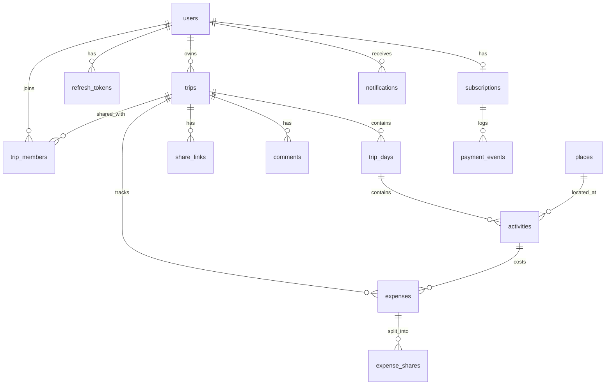

# Smart Trip Planner — Design Document

> Tài liệu thiết kế kỹ thuật. Mọi quyết định trong file này là **nguồn sự thật duy nhất** cho việc implement.
> Phiên bản: 1.0 — Mục tiêu: sản phẩm portfolio cho vị trí Backend / Fullstack Java.

---

## 1. Tổng quan

### 1.1. Mô tả

Smart Trip Planner là web app giúp người dùng lên kế hoạch cho một chuyến đi: tạo chuyến đi theo khoảng ngày, thêm hoạt động cho từng ngày, gắn địa điểm lên bản đồ, xem dự báo thời tiết cho từng ngày, mời bạn bè cùng chỉnh sửa theo thời gian thực, theo dõi chi phí, và nâng cấp Premium để mở khoá các giới hạn.

### 1.2. Vì sao đề tài này tốt cho CV

| Điểm kỹ thuật | Thể hiện ở đâu trong dự án |
|---|---|
| Authorization phức tạp (không chỉ role) | Owner / Editor / Viewer / public link trên từng resource |
| Tích hợp third-party + chống phụ thuộc | Provider abstraction, circuit breaker, cache |
| Xử lý thanh toán an toàn | Stripe webhook + idempotency + reconciliation |
| Real-time | WebSocket STOMP cho đồng chỉnh sửa lịch trình |
| Hiệu năng | Redis cache, rate limiting, N+1 query optimization |
| Kỹ thuật vận hành | Docker, CI/CD, Flyway, test coverage, structured logging |

### 1.3. Đối tượng người dùng

| Actor | Mô tả |
|---|---|
| Guest | Chưa đăng nhập. Chỉ xem được trip qua public share link. |
| User (FREE) | Đầy đủ chức năng nhưng bị giới hạn hạn mức. |
| User (PREMIUM) | Bỏ giới hạn, mở khoá AI suggest, export PDF, weather alert. |
| Admin | Quản lý user, xem thống kê, xem log thanh toán. |

---

## 2. Phạm vi (Scope)

### 2.1. In scope — Phase 1 → 4

- Auth: đăng ký, đăng nhập, refresh token, verify email, quên/đặt lại mật khẩu
- Quản lý chuyến đi: CRUD, clone, archive, soft delete
- Lịch trình: TripDay tự sinh, Activity CRUD + reorder + validate trùng giờ
- Địa điểm: search (mock → OSM), lưu snapshot, hiển thị bản đồ, tính khoảng cách giữa các điểm
- Thời tiết: forecast theo ngày của trip, cache Redis, cảnh báo hoạt động ngoài trời (cảnh báo: hoãn ngày 2026-10-02, rule 14.21)
- Chia sẻ: mời theo email với role EDITOR/VIEWER, public share link có thể thu hồi
- Real-time: đồng chỉnh sửa activity qua WebSocket, presence (ai đang xem trip)
- Chi phí: ghi nhận expense, tổng hợp theo ngày/trip, chia tiền giữa thành viên
- Premium: Stripe Checkout, webhook, Customer Portal, feature gating
- AI: gợi ý lịch trình cho một điểm đến + số ngày (chỉ Premium)
- Notification: in-app + email bất đồng bộ
- Admin: thống kê, khoá/mở user, xem payment event

### 2.2. Out of scope (ghi rõ để không bị scope creep)

- Đặt vé máy bay / khách sạn thật
- Thanh toán nội địa (VNPay/MoMo) — Stripe test mode là đủ
- Mobile app native
- Dịch đa ngôn ngữ toàn bộ UI (chỉ chuẩn bị sẵn cấu trúc i18n cho message backend)
- Offline mode

---

## 3. Tech Stack

### 3.1. Backend

| Thành phần | Lựa chọn | Lý do |
|---|---|---|
| Language | Java 21 | Record, pattern matching, virtual thread cho @Async |
| Framework | Spring Boot 4.1.x | Spring Framework 7, Jakarta EE 11, Jackson 3 |
| Security | Spring Security 7 + JJWT 0.12+ (`jjwt-api` + `jjwt-impl`, **không** dùng `jjwt-jackson` vì nó kéo Jackson 2) | Access token + refresh token. JSON cho JJWT do `security/JwtJsonCodec` tự cài bằng Jackson 3 (`tools.jackson.databind.ObjectMapper`) |
| Persistence | Spring Data JPA (Hibernate 7) | |
| Database | MySQL 8.0 | |
| Migration | Flyway | Versioned SQL. Hibernate `ddl-auto: validate` ở mọi môi trường (kể cả test), schema chỉ do Flyway tạo |
| Cache / rate limit | Redis 7 + Spring Data Redis + Bucket4j | |
| Realtime | Spring WebSocket + STOMP | |
| Mapping | MapStruct 1.6 | Entity ↔ DTO, compile-time |
| Boilerplate | Lombok | |
| Validation | Jakarta Bean Validation (Hibernate Validator) | |
| API Docs | springdoc-openapi 3.1.x | Dòng 3.1 build trên Spring Boot 4.1. Không nằm trong BOM của Boot → khai báo version ở `libs.versions.toml`. Swagger UI tại `/swagger-ui.html` |
| Payment | Stripe Java SDK | |
| Mail | `spring-boot-starter-mail` (JavaMailSender/SMTP) + `spring-boot-starter-thymeleaf` (template HTML) | Nằm sau `provider/mail/MailProvider`: `smtp` (MailHog local, Brevo prod) hoặc `mock` (log + lưu bộ nhớ, dùng trong test). Gửi `@Async` trên virtual thread |
| Resilience | Resilience4j 2.4.0 (`resilience4j-spring-boot4`, thêm ở Task 3.8) | Thử lại, ngắt mạch và giới hạn tần suất cho provider ngoài; giới hạn thời gian đặt ở `RestClient` (mục 7.3) |
| Test | JUnit 5, Mockito, AssertJ, Testcontainers, Rest Assured | |
| Coverage | JaCoCo (ngưỡng 70% line cho package `service`) | |
| Build | Gradle 9 (Groovy DSL — `build.gradle`) | Spring Boot 4 hỗ trợ Gradle 8.14+, khuyến nghị Gradle 9 |

> **Lưu ý Gradle — thứ tự annotation processor.** Lombok và MapStruct phải khai báo đúng thứ tự, nếu không MapStruct sẽ sinh mapper rỗng vì không thấy getter/setter do Lombok tạo:
>
> ```groovy
> // build.gradle — version lấy từ gradle/libs.versions.toml (CLAUDE.md rule 27), không ghi số inline
> dependencies {
>     implementation libs.mapstruct.core
>
>     compileOnly 'org.projectlombok:lombok'                 // version do Spring Boot BOM quản
>     annotationProcessor 'org.projectlombok:lombok'
>     annotationProcessor libs.lombok.mapstruct.binding
>     annotationProcessor libs.mapstruct.processor
>
>     testCompileOnly 'org.projectlombok:lombok'
>     testAnnotationProcessor 'org.projectlombok:lombok'
> }
> ```
>
> ```toml
> # gradle/libs.versions.toml
> [versions]
> mapstruct = "1.6.3"
> lombok-mapstruct-binding = "0.2.0"
> [libraries]
> mapstruct-core = { module = "org.mapstruct:mapstruct", version.ref = "mapstruct" }
> mapstruct-processor = { module = "org.mapstruct:mapstruct-processor", version.ref = "mapstruct" }
> lombok-mapstruct-binding = { module = "org.projectlombok:lombok-mapstruct-binding", version.ref = "lombok-mapstruct-binding" }
> ```
>
> Thứ tự bắt buộc: `lombok` → `lombok-mapstruct-binding` → `mapstruct-processor`.

### 3.2. Frontend

| Thành phần | Lựa chọn |
|---|---|
| Framework | React 19 + Vite 8 + TypeScript |
| Styling | TailwindCSS v4 (plugin `@tailwindcss/vite`, không có `tailwind.config.js`, chỉ `@import "tailwindcss"` trong `index.css`). Component dùng chung **tự viết** trong `src/components/` (`Button`, `FormField`, `Modal`, `ConfirmDialog`...), **không dùng shadcn/ui** (chốt 2026-09-30, Task 2.5). Từ Task 2.6: màu, bo góc, bóng, font khai báo bằng `@theme` trong `src/styles/tokens.css` |
| Giao diện | **`UI_GUIDE.md` ở thư mục gốc là nguồn sự thật về giao diện** (token, component, bố cục từng màn, prompt Stitch ở mục 15) — chốt 2026-10-01, Task 2.6. Mâu thuẫn giữa UI_GUIDE và mục 15 của file này về bố cục → theo UI_GUIDE; về route, API → theo file này |
| Font | Inter (Google Fonts, nạp bằng `<link>` trong `index.html`), đổi từ Be Vietnam Pro ở Task 3.9; chi tiết ở `UI_GUIDE.md` mục 4.1 |
| Icon | lucide-react (Task 2.6) |
| Test | Vitest (Task 3.7): `npm run test`, môi trường node, test hàm thuần trong `lib/`, `features/*/` và `stores/`. Test component bằng Testing Library: Task 8.3 |
| Menu thả xuống | @radix-ui/react-dropdown-menu (menu "⋮" của activity, Task 2.6): có sẵn điều hướng bàn phím và focus |
| Server state | TanStack Query v5 |
| Client state | Zustand |
| Routing | React Router v7 (package `react-router-dom`) |
| Form | react-hook-form + zod |
| Map | Leaflet 1.9 + react-leaflet 5 (Task 3.6), tải lười cùng trang chi tiết chuyến đi. **Hình nền mặc định là tile chuẩn của OpenStreetMap** (`tile.openstreetmap.org`): không cần API key, nên bản đồ chạy được ngay trên một bản clone mới (CLAUDE.md rule 20); điều khoản yêu cầu ghi "© OpenStreetMap contributors" ở góc bản đồ và cấm tải hàng loạt. Nền giữ màu gốc của nguồn (bản đầu làm nhạt bằng CSS, bỏ ngày 2026-10-04 vì trang bị xám; `UI_GUIDE.md` mục 9). Trình duyệt tự tải tile, không đi qua backend. **Đổi ngày 2026-10-04:** bản trước chọn CartoDB Positron và ghi "không cần API key"; kiểm lại điều khoản ngày 2026-10-04 thì CARTO đã bắt buộc API key (tile không kèm key bị thay bằng ô chữ "API KEY REQUIRED"; key miễn phí cho dự án phi thương mại, tối đa 5 triệu lượt tải mỗi tháng). **Chốt 2026-10-05 (Mốc 0 Task 3.8): không làm tuỳ chọn CARTO.** Nền OpenStreetMap đã được chủ dự án xem và giữ; key của CARTO phải đặt trong biến `VITE_*`, tức nằm trong bundle công khai. Muốn đổi nền sau này chỉ sửa `lib/mapTiles.ts` |
| Realtime | @stomp/stompjs + sockjs-client |
| HTTP | axios + interceptor tự refresh token |
| Drag & drop | dnd-kit (core 6.3, sortable 10.0, utilities 3.2) |
| Chart | recharts (trang expense + admin dashboard) |
| Lint | ESLint (flat config do create-vite sinh: typescript-eslint, react-hooks, react-refresh) |

> Phiên bản chốt ngày 2026-09-18 theo bản scaffold thực tế của Task 0.5 (React 19.2, React Router 7.18, Tailwind 4.3, Vite 8.3). Các thư viện còn lại cài ở task nào thì lấy bản mới nhất tương thích React 19 tại thời điểm đó.

**Quy ước gọi API từ frontend:**
- Một axios instance duy nhất ở `src/api/client.ts`, `baseURL` đọc từ `VITE_API_URL`, mặc định `/api/v1` (đường dẫn **tương đối**). Dev đi qua proxy `/api` của Vite (`vite.config.ts`, `strictPort: true` để luôn đúng origin `localhost:5173` mà CORS backend cho phép), prod đi qua nginx. Không hardcode `http://localhost:8080` trong code frontend.
- `withCredentials: true` vì refresh token nằm trong httpOnly cookie (mục 6.1).
- Mỗi module API là một file trong `src/api/` (`health.ts`, `auth.ts`, `trips.ts`...), trả về body đã có type, component không gọi axios trực tiếp.
- Type `ApiResponse<T>` / `ErrorResponse` tạm viết tay ở `src/types/api.ts`, sẽ thay bằng type sinh từ OpenAPI (`npm run gen:api`) khi có.

### 3.3. Infrastructure

| Thành phần | Lựa chọn |
|---|---|
| Container | Docker + docker-compose (mysql, redis, backend, frontend-nginx, mailhog) |
| CI | GitHub Actions: build → test → jacoco report → build image → push GHCR |
| CD | Deploy VPS qua SSH + docker compose pull/up (hoặc Railway/Render nếu không có VPS) |
| Reverse proxy | Nginx (serve static frontend + proxy `/api` sang backend) |
| TLS | Let's Encrypt qua Certbot / Cloudflare |
| Mail (dev) | MailHog — xem mail tại `localhost:8025` |
| Mail (prod) | Brevo / Resend SMTP free tier |

---

## 4. Kiến trúc

### 4.1. Sơ đồ tầng

```
┌────────────────────────────────────────────────────────────┐
│  React SPA (Vite)                                          │
└───────────────┬───────────────────────┬────────────────────┘
                │ REST /api/v1          │ WebSocket /ws
┌───────────────▼───────────────────────▼────────────────────┐
│  Controller layer   (validate input, trả ApiResponse)      │
├────────────────────────────────────────────────────────────┤
│  Service layer      (business rule, @Transactional, quota) │
├──────────────┬──────────────────────┬──────────────────────┤
│ Repository   │ Provider (port)      │ Publisher (WS/Event) │
│  (JPA)       │  Map/Weather/Pay/AI  │                      │
├──────────────┼──────────────────────┼──────────────────────┤
│   MySQL      │ Mock impl / Real impl│   Redis              │
└──────────────┴──────────────────────┴──────────────────────┘
```

**Quy tắc bắt buộc:**
- Controller **không** chứa business logic, **không** nhận/trả Entity.
- Service **không** biết tới `HttpServletRequest`, `ResponseEntity`.
- Repository **không** gọi Service.
- Entity **không bao giờ** rời khỏi tầng service (luôn map sang DTO).

### 4.2. Cấu trúc package

```
com.trieu.tripplanner
├── TripPlannerApplication.java
├── common
│   ├── ApiResponse.java              // envelope thành công
│   ├── ErrorResponse.java            // envelope lỗi
│   ├── PageResponse.java
│   ├── constant/                     // AppConstants, CacheNames, ErrorCode
│   └── util/                         // DateUtils, SlugUtils, TokenUtils, GeoUtils
├── config
│   ├── SecurityConfig.java           // filter chain, PasswordEncoder, AuthenticationManager
│   ├── RedisConfig.java
│   ├── CacheConfig.java
│   ├── WebSocketConfig.java
│   ├── OpenApiConfig.java
│   ├── AsyncConfig.java
│   ├── ClockConfig.java              // bean Clock: nguồn "bây giờ" duy nhất, test thay bằng đồng hồ đứng yên (Task 3.3)
│   ├── CorsConfig.java
│   └── properties/                   // @ConfigurationProperties + @Validated: AppProperties (app), JwtProperties (app.jwt), StripeProperties...
├── security
│   ├── JwtTokenProvider.java
│   ├── JwtJsonCodec.java             // Serializer/Deserializer của JJWT chạy trên Jackson 3
│   ├── JwtAuthenticationFilter.java
│   ├── CustomUserDetails.java
│   ├── CustomUserDetailsService.java
│   ├── RestAuthenticationEntryPoint.java
│   ├── RestAccessDeniedHandler.java
│   └── permission/
│       ├── TripPermissionEvaluator.java
│       └── annotation/@CanEditTrip, @CanViewTrip
├── exception
│   ├── GlobalExceptionHandler.java
│   ├── AppException.java             // base, chứa ErrorCode
│   ├── ResourceNotFoundException.java
│   ├── BusinessRuleException.java
│   ├── EmailAlreadyExistsException.java   // 409, ném từ AuthService.register (Task 1.2)
│   ├── QuotaExceededException.java
│   └── PaymentException.java
├── model                             // JPA entities
│   ├── BaseEntity.java               // id, createdAt, updatedAt
│   ├── AuditableEntity.java          // + createdBy, updatedBy
│   └── enums/
├── repository
├── dto
│   ├── request/
│   ├── response/
│   └── internal/                     // record dùng nội bộ giữa các service
├── mapper                            // MapStruct
├── service
│   ├── AuthService / UserService
│   ├── TripService / TripDayService / ActivityService
│   ├── PlaceService / WeatherService
│   ├── SharingService / CommentService
│   ├── ExpenseService
│   ├── SubscriptionService / StripeWebhookService
│   ├── AiItineraryService
│   ├── NotificationService / MailService
│   └── AdminService
├── provider                          // ★ tầng chống phụ thuộc third-party
│   ├── map/     MapProvider, MockMapProvider, OsmMapProvider
│   ├── weather/ WeatherProvider, MockWeatherProvider, OpenMeteoWeatherProvider
│   ├── payment/ PaymentProvider, MockPaymentProvider, StripePaymentProvider
│   ├── ai/      AiProvider, MockAiProvider, ClaudeAiProvider
│   ├── storage/ StorageProvider, LocalStorageProvider, CloudinaryStorageProvider
│   └── mail/    MailProvider, MockMailProvider, SmtpMailProvider   // MailService (service/) render Thymeleaf rồi gọi port này
├── controller
│   └── admin/
├── websocket
│   ├── TripCollabController.java     // @MessageMapping
│   ├── WebSocketAuthInterceptor.java
│   └── event/                        // ActivityChangedEvent, PresenceEvent
└── scheduler
    ├── TripReminderScheduler.java
    └── SubscriptionSyncScheduler.java
```

Frontend:

```
src
├── api/            // axios client, endpoint theo module
├── components/     // component dùng chung tự viết (Button, FormField, Modal...); map/ thêm ở Phase 3
├── features/
│   ├── auth/  trips/  itinerary/  sharing/  expense/  billing/  admin/
├── hooks/
├── layouts/
├── pages/
├── stores/         // zustand: authStore, tripCollabStore
├── types/          // sinh từ OpenAPI schema
└── lib/            // formatters, guards, constants
```

---

## 5. Data Model

### 5.1. ERD


```mermaid
erDiagram
    users ||--o{ trips : owns
    users ||--o{ refresh_tokens : has
    users ||--o{ trip_members : joins
    users ||--o| subscriptions : has
    users ||--o{ notifications : receives
    trips ||--o{ trip_days : contains
    trips ||--o{ trip_members : shared_with
    trips ||--o{ share_links : has
    trips ||--o{ comments : has
    trips ||--o{ expenses : tracks
    trip_days ||--o{ activities : contains
    places ||--o{ activities : located_at
    activities ||--o{ expenses : costs
    expenses ||--o{ expense_shares : split_into
    subscriptions ||--o{ payment_events : logs
```

### 5.2. Chi tiết bảng

#### `users`
| Cột | Kiểu | Ghi chú |
|---|---|---|
| id | BIGINT PK AI | |
| email | VARCHAR(255) | UNIQUE, lowercase |
| password_hash | VARCHAR(255) | BCrypt strength 12 |
| full_name | VARCHAR(120) | |
| avatar_url | VARCHAR(512) | nullable |
| timezone | VARCHAR(64) | default `Asia/Ho_Chi_Minh` |
| locale | VARCHAR(10) | default `vi` |
| role | ENUM | `USER`, `ADMIN` |
| plan | ENUM | `FREE`, `PREMIUM` |
| plan_expires_at | DATETIME | nullable |
| email_verified | BOOLEAN | default false |
| status | ENUM | `ACTIVE`, `BLOCKED` |
| created_at / updated_at | DATETIME | |
| deleted_at | DATETIME | soft delete |

Index: `UNIQUE uk_users_email(email)` (UNIQUE key đã là index nên kiêm luôn vai trò `idx_users_email`, không tạo thêm), `idx_users_plan(plan)`

> **Quy ước kiểu cột áp dụng cho mọi bảng** (chốt ở Task 1.1, migration `V2__create_users_table.sql`):
> - `DATETIME` trong tài liệu = `DATETIME(6)` trong SQL, vì Hibernate ghi `java.time.Instant` với micro giây.
> - `ENUM` = kiểu `ENUM('A','B')` gốc của MySQL; entity dùng `@Enumerated(EnumType.STRING)`, Hibernate 7 map thẳng sang ENUM nên `ddl-auto=validate` khớp. Thêm/đổi giá trị enum Java **phải** kèm migration `ALTER TABLE ... MODIFY col ENUM(...)`, vì validate không so danh sách giá trị, lỗi chỉ lộ lúc INSERT (`Data truncated`).
> - `BOOLEAN` = `TINYINT(1)`, driver MySQL báo về là BIT nên khớp `boolean` Java.
> - Collation `utf8mb4_unicode_ci` **không phân biệt hoa thường** khi so chuỗi; email vẫn được chuẩn hoá lowercase ở entity (`@PrePersist`) để giá trị lưu nhất quán.
> - Soft delete: `@SQLDelete("UPDATE ... SET deleted_at = NOW(6) WHERE id = ?")` + `@SQLRestriction("deleted_at IS NULL")`. Hệ quả: UNIQUE `email` vẫn chặn đăng ký lại email đã xoá mềm — chấp nhận, xử lý ở Phase 8 nếu cần (admin khôi phục hoặc anonymize).

#### `refresh_tokens`
| Cột | Kiểu | Ghi chú |
|---|---|---|
| id | BIGINT PK AI | |
| user_id | BIGINT FK → users.id | `ON DELETE CASCADE` |
| token_hash | CHAR(64) | SHA-256 hex, **không lưu token thô** |
| expires_at | DATETIME | |
| revoked_at | DATETIME | nullable |
| revoked_reason | ENUM | nullable. `ROTATED`, `LOGOUT`, `PASSWORD_RESET`, `BLOCKED`, `EXPIRED`, `REUSE_DETECTED`. Thêm ở V8 (Task 2.7): ghi **vì sao** token bị thu hồi, để phân biệt token đã xoay vòng với token bị thu hồi vì lý do khác (mục 6.1). Dòng đã thu hồi trước V8 để `NULL` và được xử lý như `ROTATED` |
| user_agent | VARCHAR(255) | nullable, cắt ngắn nếu dài hơn |
| ip_address | VARCHAR(45) | nullable, đủ cho IPv6 |
| created_at / updated_at | DATETIME | từ BaseEntity |

Index: `UNIQUE uk_refresh_tokens_token_hash(token_hash)`, `idx_refresh_tokens_user_id(user_id)`. Không soft delete: token hết hạn/revoke được scheduler xoá cứng sau 30 ngày (Phase 8).

#### `verification_tokens`
| Cột | Kiểu | Ghi chú |
|---|---|---|
| id | BIGINT PK AI | |
| user_id | BIGINT FK → users.id | `ON DELETE CASCADE` |
| token_hash | CHAR(64) | SHA-256 hex của token trong link, **không lưu token thô** (cùng cách với refresh_tokens) |
| type | ENUM('EMAIL_VERIFY','PASSWORD_RESET') | |
| expires_at | DATETIME | EMAIL_VERIFY: +24h, PASSWORD_RESET: +1h |
| used_at | DATETIME | nullable; token dùng một lần |
| created_at / updated_at | DATETIME | từ BaseEntity |

Index: `UNIQUE uk_verification_tokens_token_hash(token_hash)`, `idx_verification_tokens_user_type(user_id, type)`.

Quy tắc: phát token mới cho cùng `(user, type)` → đánh dấu `used_at` mọi token cũ còn sống của cặp đó (chỉ token mới nhất dùng được). Token sai / hết hạn / đã dùng / sai loại → cùng một lỗi 400 `INVALID_TOKEN`, không phân biệt để không lộ token nào tồn tại. Link trong mail: `${app.frontend-url}/verify-email?token=...` và `${app.frontend-url}/reset-password?token=...`; trang frontend đọc query rồi POST token lên API.

#### `trips`
| Cột | Kiểu | Ghi chú |
|---|---|---|
| id | BIGINT PK | |
| owner_id | BIGINT FK users | |
| title | VARCHAR(160) | |
| slug | VARCHAR(200) | unique, dùng cho public URL (Phase 4). Sinh **một lần** khi tạo (chốt 2026-09-26): bỏ dấu tiếng Việt của title → kebab-case (cắt ≤ 150 ký tự) + `-` + 6 ký tự ngẫu nhiên `[a-z0-9]`, ví dụ `da-lat-3-ngay-x7k2qp`; trùng thì sinh lại. **Không đổi khi sửa title** để link đã chia sẻ không hỏng |
| description | TEXT | nullable, ≤ 1000 ký tự (validate ở DTO; 5000 trước Task 2.5) |
| cover_image_url | VARCHAR(512) | |
| destination_name | VARCHAR(200) | nullable: tạo trip trước, chọn điểm đến sau |
| destination_lat / lng | DECIMAL(10,7) / DECIMAL(10,7) | |
| start_date / end_date | DATE | end >= start, tối đa 60 ngày tính cả hai đầu (rule 14.1) |
| budget_amount | DECIMAL(15,2) | nullable |
| currency | CHAR(3) | default `VND` |
| status | ENUM | `DRAFT`, `PLANNED`, `ONGOING`, `COMPLETED`, `ARCHIVED`; mặc định `DRAFT` |
| visibility | ENUM | `PRIVATE`, `LINK`, `PUBLIC`; mặc định `PRIVATE` |
| version | BIGINT NOT NULL DEFAULT 0 | `@Version` — optimistic locking khi nhiều người cùng sửa (mục 11.3, chốt 2026-09-26) |
| created_at / updated_at / deleted_at | | |

Index: `idx_trips_owner_status(owner_id, status)`, `idx_trips_slug(slug)` (hiện thực bằng `UNIQUE uk_trips_slug`).
Ràng buộc (chốt Task 2.1): `CHECK chk_trips_date_range (end_date >= start_date)` là chốt chặn cuối ở DB, lỗi thân thiện vẫn do service trả; FK `fk_trips_owner` **không** `ON DELETE CASCADE` (user bị soft delete, xoá cứng user không được âm thầm xoá trip).

#### `trip_days`
| Cột | Kiểu | Ghi chú |
|---|---|---|
| id | BIGINT PK AI | |
| trip_id | BIGINT FK → trips.id | `ON DELETE CASCADE`: ngày thuộc trọn về trip, trip bị xoá cứng (scheduler, rule 14.8) thì ngày đi theo |
| day_index | INT | số thứ tự **1..n**, liên tục, đánh lại mỗi khi khoảng ngày của trip đổi |
| date | DATE | ngày lịch thật |
| title | VARCHAR(160) | nullable — không có thì giao diện hiện "Ngày N" |
| note | TEXT | nullable, ≤ 255 ký tự (validate ở DTO; 5000 trước Task 2.5, cột giữ `TEXT` nên không cần migration) |
| created_at / updated_at | DATETIME | từ BaseEntity |

UNIQUE `(trip_id, date)` — sinh tự động khi tạo/đổi ngày trip (rule 14.2, 14.3).

Quy tắc (chốt 2026-09-27):
- Các ngày của một trip **luôn liên tiếp**: mỗi ngày từ `start_date` tới `end_date` có đúng một `TripDay`. Không hỗ trợ trip có ngày không liên tiếp (giữ nguyên mô hình dữ liệu).
- Response trả cả `dayIndex` và `date`; giao diện hiển thị kiểu "Ngày 1 · Thứ Năm, 01/01/2026".
- **Không soft delete**: ngày chỉ bị xoá khi người dùng cắt khoảng ngày của trip; dòng đã xoá mềm sẽ vẫn chiếm `UNIQUE (trip_id, date)` và chặn việc kéo dài trip trở lại đúng ngày cũ. Soft delete trip không đụng tới ngày (khôi phục trip thì ngày còn nguyên).
- **Không `@Version`**: CLAUDE.md rule 22 chỉ yêu cầu cho Trip và Activity.

#### `activities`
| Cột | Kiểu | Ghi chú |
|---|---|---|
| id | BIGINT PK AI | |
| trip_day_id | BIGINT FK → trip_days.id | NOT NULL, `ON DELETE CASCADE`: ngày bị xoá (cắt khoảng ngày với `force=true`, hoặc trip bị xoá cứng) thì activity đi theo |
| place_id | BIGINT FK places | nullable. Không có ở V7: thêm bằng **V10** (Task 3.2), sau khi V9 tạo bảng `places`. FK **không** `ON DELETE CASCADE`: địa điểm là bản lưu dùng chung, không bị xoá theo activity. Mỗi activity có nhiều nhất **một** địa điểm; ngày của chuyến đi không có địa điểm riêng |
| title | VARCHAR(200) | NOT NULL, được trim khi lưu |
| type | ENUM | `SIGHTSEEING`, `FOOD`, `TRANSPORT`, `ACCOMMODATION`, `SHOPPING`, `OTHER`; NOT NULL, mặc định `OTHER` |
| start_time / end_time | TIME | nullable, end > start; có `end_time` thì phải có `start_time` |
| order_index | INT | NOT NULL, dùng cho drag-drop (rule 14.5) |
| note | TEXT | nullable, ≤ 255 ký tự (validate ở DTO; 5000 trước Task 2.5) |
| cost_amount | DECIMAL(15,2) | nullable, >= 0 |
| currency | CHAR(3) | nullable; có `cost_amount` mà không gửi `currency` → lấy `currency` của trip |
| booking_url | VARCHAR(512) | nullable |
| created_by | BIGINT FK → users.id | NOT NULL, **không** `ON DELETE CASCADE` (cùng lý do với `trips.owner_id`); phục vụ realtime & audit |
| version | BIGINT NOT NULL DEFAULT 0 | `@Version` — optimistic locking (mục 11.3, CLAUDE.md rule 22) |
| created_at / updated_at | DATETIME(6) | từ BaseEntity |

Index: `idx_activities_day_order(trip_day_id, order_index)`

Quy tắc (chốt 2026-09-29, Task 2.3):
- **Xoá cứng**, không có `deleted_at`: activity là dữ liệu con của ngày, không có nhu cầu khôi phục riêng. Soft delete trip không đụng tới activity (khôi phục trip thì activity còn nguyên).
- Ràng buộc ở DB là chốt chặn cuối, lỗi thân thiện vẫn do service trả: `CHECK chk_activities_time_range (end_time IS NULL OR (start_time IS NOT NULL AND end_time > start_time))`, `CHECK chk_activities_cost (cost_amount IS NULL OR cost_amount >= 0)`.
- Không hỗ trợ activity kéo qua nửa đêm (ví dụ 23:00 → 01:00): tách thành hai activity ở hai ngày.

#### `places`
| Cột | Kiểu | Ghi chú |
|---|---|---|
| id | BIGINT PK AI | |
| provider | ENUM | `MOCK`, `OSM`, `MANUAL`: nguồn của địa điểm. (`GOOGLE` của bản cũ bỏ: chưa có kế hoạch dùng) |
| external_id | VARCHAR(128) | mã của địa điểm ở nguồn; `NULL` với `MANUAL` |
| name | VARCHAR(200) | NOT NULL |
| address | VARCHAR(500) | nullable |
| lat / lng | DECIMAL(10,7) | NOT NULL |
| category | VARCHAR(40) | nullable. Dữ liệu mock dùng đúng 6 tên của `ActivityType` để form gợi ý sẵn loại hoạt động; nguồn thật có thể trả giá trị khác nên không dùng ENUM |
| created_by | BIGINT FK → users.id | nullable; chỉ có với `MANUAL` (người tạo), không `ON DELETE CASCADE` |
| created_at / updated_at | DATETIME(6) | từ BaseEntity |

UNIQUE `(provider, external_id)` (MySQL cho phép nhiều dòng `external_id` `NULL`, nên địa điểm `MANUAL` không vướng).

Quy tắc (chốt 2026-10-01, rà soát Phase 3; danh sách cột chốt lại ở bảng commit Task 3.2):
- Đây là **bản lưu (snapshot)** của địa điểm: trang chuyến đi hiển thị từ bảng này, không gọi lại dịch vụ ngoài. Một địa điểm của nguồn chỉ có một dòng, mọi người chọn nó dùng chung dòng đó (rule 14.18).
- Địa điểm `MANUAL` là **riêng tư** của người tạo (rule 14.19).
- Bỏ `photo_url`, `rating`, `raw_json` của bản cũ: chưa màn nào dùng (`UI_GUIDE.md` 15.3 không hiện đánh giá sao).

#### `trip_members`
| Cột | Ghi chú |
|---|---|
| id, trip_id FK (ON DELETE CASCADE), user_id FK (nullable) | `user_id` nullable khi mời email chưa có tài khoản; gán lúc mời nếu email đã có tài khoản, hoặc lúc nhận lời |
| invited_email VARCHAR(255) | lowercase, chuẩn hoá như `users.email` |
| role ENUM | `EDITOR`, `VIEWER` — **không có `OWNER`** (chốt 2026-10-06, rà Phase 4): chủ chuyến không có dòng, `trips.owner_id` là nguồn sự thật; API trả vai trò `OWNER` tính từ đó (`TripRole` có 3 giá trị) |
| status ENUM | `PENDING`, `ACCEPTED`, `REMOVED` (`DECLINED` bỏ: chưa có endpoint từ chối, thêm sau bằng ALTER khi cần) |
| invite_token_hash CHAR(64) nullable UNIQUE, invite_expires_at DATETIME nullable | SHA-256 của token mời, hạn **7 ngày**; xoá khi nhận lời. Không dùng `verification_tokens` vì bảng đó bắt buộc `user_id` |
| invited_by FK users, invited_at, accepted_at | |

UNIQUE `(trip_id, user_id)`, UNIQUE `(trip_id, invited_email)`. Gỡ thành viên **giữ dòng** (`status = REMOVED`); mời lại cùng email cập nhật dòng cũ về `PENDING` với token mới. Không có `deleted_at`. Migration `V11` (Task 4.1).

#### `share_links`
`id, trip_id FK (ON DELETE CASCADE), token CHAR(32) UNIQUE, permission ENUM(VIEW), expires_at nullable, revoked_at nullable, view_count INT NOT NULL DEFAULT 0, created_by FK users, created_at`

Chốt 2026-10-06 (rà Phase 4): Phase 4 chỉ có liên kết **xem**; `EDIT` thêm sau bằng ALTER khi làm liên kết sửa (xét ở Phase 5). `token` lưu **thô** (32 ký tự `[a-z0-9]` từ `SecureRandom`), không băm: liên kết sinh ra để đưa cho người khác, chỉ cho xem, và phải liệt kê / sao chép lại được; token mời (`trip_members`) thì băm vì nó cấp quyền trên tài khoản. Thu hồi = `revoked_at`, không có `deleted_at`. Migration `V12` (Task 4.2).

#### `comments`
`id, trip_id FK (ON DELETE CASCADE), activity_id FK nullable (ON DELETE CASCADE), user_id FK, parent_id FK self nullable, content TEXT (≤ 2000 ký tự, validate ở DTO), created_at, deleted_at`

Index `(trip_id, created_at)`. Soft delete như các bảng khác; xoá bình luận gốc xoá mềm luôn các trả lời (chốt 2026-10-06). Trả lời chỉ **một cấp**: `parent_id` phải trỏ tới bình luận gốc (`parent_id IS NULL`) của cùng trip. Migration `V13` (Task 4.4).

#### `expenses`
`id, trip_id FK, activity_id FK nullable, paid_by_user_id FK, title, amount DECIMAL(15,2), currency CHAR(3), category ENUM, spent_at DATE, note`

#### `expense_shares`
`id, expense_id FK, user_id FK, amount DECIMAL(15,2)` — tổng amount phải bằng expense.amount.

#### `subscriptions`
`id, user_id FK UNIQUE, provider, provider_customer_id, provider_subscription_id, plan_code ENUM(PREMIUM_MONTHLY, PREMIUM_YEARLY), status ENUM(ACTIVE, PAST_DUE, CANCELED, INCOMPLETE), current_period_start, current_period_end, cancel_at_period_end BOOLEAN`

#### `payment_events`
`id, provider, event_id VARCHAR(255) UNIQUE, type, payload_json JSON, status ENUM(RECEIVED, PROCESSED, FAILED), processed_at, error_message`
→ **UNIQUE trên `event_id` chính là cơ chế idempotency.**

#### `notifications`
`id, user_id FK, type ENUM, title, message, link, read_at, created_at`

#### `ai_suggestion_logs`
`id, user_id FK, trip_id FK nullable, prompt_hash CHAR(64), model, tokens_used INT, latency_ms INT, created_at`
→ dùng cho rate limit AI và cache theo `prompt_hash`.

---

## 6. Security & Authorization

### 6.1. Token

| | Access Token | Refresh Token |
|---|---|---|
| Dạng | JWT (HS256) | Chuỗi random 64 ký tự |
| TTL | 15 phút | 7 ngày |
| Lưu ở client | memory (Zustand) | httpOnly cookie |
| Lưu ở server | không | hash SHA-256 trong DB |
| Revoke | không (TTL ngắn) | có, qua `revoked_at` + `revoked_reason` |

Claims: `sub` (userId), `email`, `role`, `plan`, `iat`, `exp`, `jti`.

**Rotation:** mỗi lần gọi `/auth/refresh` thành công → revoke token cũ với lý do `ROTATED`, phát token mới.

**Refresh token không còn dùng được bị gửi lại** (chốt 2026-10-01, Task 2.7), kiểm theo thứ tự:
1. Không có cookie, hoặc token không có trong DB → 401.
2. Token đã **hết hạn** → 401; nếu chưa bị thu hồi thì đánh dấu `EXPIRED`. Không đụng tới phiên khác: kiểm hết hạn **trước** để một token cũ không thể dùng làm "nút tắt mọi phiên" lâu hơn 7 ngày.
3. Token đã bị thu hồi do **xoay vòng** (`ROTATED`, hoặc dòng cũ chưa có lý do) → coi là token theft: revoke **toàn bộ** token đang sống của user với lý do `REUSE_DETECTED`, trả 401. Token đã xoay chỉ còn nằm ở bản sao bị đánh cắp hoặc ở một client chạy sai.
4. Token bị thu hồi vì lý do khác (`LOGOUT`, `PASSWORD_RESET`, `BLOCKED`, `EXPIRED`, `REUSE_DETECTED`) → **chỉ** 401. Đây là thiết bị cũ còn giữ cookie sau khi người dùng đăng xuất hoặc đặt lại mật khẩu ở nơi khác, không phải dấu hiệu trộm.
5. Token còn sống nhưng tài khoản `BLOCKED` → revoke toàn bộ (`BLOCKED`), 403 `ACCOUNT_BLOCKED`.

Mọi lần refresh bị từ chối vì token (401, bước 1–4), response kèm `Set-Cookie` xoá `refresh_token` (`Max-Age=0`) để trình duyệt thôi gửi lại token chết. Bước 5 (403) không xoá cookie: token vừa bị thu hồi với lý do `BLOCKED`, lần gửi lại kế tiếp rơi vào bước 4 và cookie bị xoá ở đó.

> Trước Task 2.7, mọi token đã revoke bị gửi lại đều bị coi là theft. Hệ quả (BUG-AUTH-006): đặt lại mật khẩu ở máy A (rule 14.16 revoke mọi token), máy B còn cookie cũ mở trang → phiên mới của A bị thu hồi, lặp lại mỗi lần B tải trang.

**Cookie refresh token** (chốt Task 1.3): tên `refresh_token`, `HttpOnly`, `SameSite=Lax` (chặn site khác POST kèm cookie, thay cho CSRF token đã tắt), `Path=/api/v1/auth` (chỉ gửi kèm khi gọi refresh/logout), `Max-Age` = TTL refresh, `Secure` khi profile `prod`. Token thô chỉ tồn tại trong cookie; DB giữ SHA-256.

**Kết quả login** (`AuthResponse`): `{ accessToken, tokenType: "Bearer", expiresIn (giây), user: UserResponse }`. Refresh trả cùng cấu trúc. Logout: revoke token trong cookie + xoá cookie (`Max-Age=0`), trả `data: null`.

**Thứ tự kiểm tra khi login:** email không tồn tại hoặc sai mật khẩu → 401 `INVALID_CREDENTIALS` (một message chung, không tiết lộ email có tồn tại); `status = BLOCKED` → 403 `ACCOUNT_BLOCKED`; `email_verified = false` → 403 `EMAIL_NOT_VERIFIED`. Tài khoản soft-delete không tìm thấy → 401 `INVALID_CREDENTIALS`.

**Access token ở filter:** thiếu/sai chữ ký → 401 `UNAUTHORIZED`; đúng chữ ký nhưng hết hạn → 401 `TOKEN_EXPIRED` (frontend interceptor thấy mã này mới gọi refresh, tránh refresh vô ích khi token sai). `JwtAuthenticationFilter` ghi lỗi vào request attribute, `RestAuthenticationEntryPoint` đọc để chọn mã.

**Cấu hình `app.jwt.*`** (`JwtProperties`, `@Validated`): `secret` (≥ 64 ký tự, từ env `JWT_SECRET`), `access-ttl` (mặc định `15m`), `refresh-ttl` (`7d`), `issuer` (`smart-trip-planner`). Profile `test` dùng chuỗi giả ghi rõ "test-only" trong `application-test.yml`; đó là dữ liệu test, không phải secret.

### 6.2. Ma trận quyền trên Trip

| Hành động | OWNER | EDITOR | VIEWER | Link VIEW | Link EDIT (hoãn) | Guest |
|---|:--:|:--:|:--:|:--:|:--:|:--:|
| Xem trip | ✅ | ✅ | ✅ | ✅ | ✅ | ❌ |
| Sửa thông tin trip | ✅ | ✅ | ❌ | ❌ | ❌ | ❌ |
| Đổi trạng thái trip | ✅ | ✅ | ❌ | ❌ | ❌ | ❌ |
| Xoá trip | ✅ | ❌ | ❌ | ❌ | ❌ | ❌ |
| CRUD activity, reorder | ✅ | ✅ | ❌ | ❌ | ✅ | ❌ |
| Xem route / weather của trip | ✅ | ✅ | ✅ | ❌ | ❌ | ❌ |
| Comment (đăng, xem) | ✅ | ✅ | ✅ | ❌ | ❌ | ❌ |
| Xoá comment | của mọi người | của mình | của mình | ❌ | ❌ | ❌ |
| Xem danh sách thành viên | ✅ | ✅ | ✅ | ❌ | ❌ | ❌ |
| Mời / đổi vai trò / gỡ thành viên | ✅ | ❌ | ❌ | ❌ | ❌ | ❌ |
| Tạo / xem / thu hồi share link | ✅ | ❌ | ❌ | ❌ | ❌ | ❌ |
| Quản lý expense | ✅ | ✅ | ❌ | ❌ | ❌ | ❌ |
| Export PDF | ✅(Premium) | ❌ | ❌ | ❌ | ❌ | ❌ |

Thành viên `PENDING` (chưa nhận lời) và `REMOVED` (đã bị gỡ) là **người lạ**: cột Guest nếu chưa đăng nhập, không có quyền gì nếu đã đăng nhập. "Link VIEW" là khách mở `GET /public/trips/{token}`, không đi qua evaluator. **Link EDIT hoãn** (chốt 2026-10-06, rà Phase 4): chưa có cách để người cầm liên kết ghi dữ liệu mà không có tài khoản; xét lại ở Phase 5 cùng realtime.

Implement bằng `TripPermissionEvaluator` + annotation tuỳ biến:

```java
@PreAuthorize("@tripPermission.canEdit(#tripId, principal)")
```

Kết quả quyền của (userId, tripId) được **cache Redis TTL 5 phút**, evict khi thay đổi membership.

> **Triển khai theo giai đoạn** (chốt 2026-09-26, cập nhật 2026-10-06 khi rà Phase 4): bean `tripPermission` (`security/permission/TripPermissionEvaluator`) có từ **Task 2.1**, lúc đó chỉ kiểm chủ sở hữu (`canView` / `canEdit` / `isOwner` ⇔ `trip.owner_id = userId`). **Task 4.1** mở rộng cho thành viên: `canView` = chủ hoặc thành viên `ACCEPTED`, `canEdit` = chủ hoặc `EDITOR`, `isOwner` = chủ, bằng một câu SQL `TripRepository.findAccess(tripId, userId)`. **Task 4.3** đặt cache Redis (`trip:permission`, 5 phút) ở bean `TripAccessCache` giữa evaluator và repository, evict khi nhận lời / đổi vai trò / gỡ; Redis tắt → đọc DB. Liên kết chia sẻ **không** đi qua evaluator (chỉ xem, qua endpoint công khai). Controller không phải sửa ở cả hai task.
> **Trip không tồn tại hoặc đã soft delete → 404 `RESOURCE_NOT_FOUND`**, không phải 403: evaluator trả `true` khi không tìm thấy trip để request đi tiếp, service ném `ResourceNotFoundException`. Trip tồn tại nhưng không có quyền → 403 `FORBIDDEN`.

### 6.3. Checklist bảo mật

- BCrypt strength 12, không log password/token
- Rate limit login: 5 lần / 15 phút / IP+email → trả 429
- CORS whitelist theo env, không dùng `*` khi có credentials
- Stripe webhook verify signature bằng `Webhook.constructEvent`
- Validate mọi input; chống mass assignment bằng cách chỉ dùng request DTO
- JPA parameter binding (không nối chuỗi query)
- Escape output ở frontend (React mặc định an toàn, không dùng `dangerouslySetInnerHTML`)
- Secret nằm ở biến môi trường, `.env` trong `.gitignore`, có `.env.example`
- Actuator chỉ expose `health`, `info`; các endpoint khác yêu cầu ADMIN
- **Mặc định khoá** (`anyRequest().authenticated()`), chỉ mở danh sách trắng trong `SecurityConfig.PUBLIC_PATHS`: `/api/v1/auth/**`, `/api/v1/ping`, `/actuator/health(/**)`, `/actuator/info`, `/swagger-ui.html`, `/swagger-ui/**`, `/v3/api-docs/**`. Stateless, CSRF tắt (token đi trong header), formLogin/httpBasic tắt.
- Lỗi ở tầng filter cũng trả `ErrorResponse`: `RestAuthenticationEntryPoint` → 401 `UNAUTHORIZED`, `RestAccessDeniedHandler` → 403 `FORBIDDEN`. Hệ quả: URL không tồn tại khi **chưa đăng nhập** trả 401 (không lộ URL nào có thật), đã đăng nhập mới trả 404. `@PreAuthorize` bị từ chối trong controller → `GlobalExceptionHandler` → 403 cùng envelope.

---

## 7. Provider Abstraction (mock trước, thật sau)

### 7.1. Nguyên tắc

Mọi dịch vụ ngoài đều nằm sau một interface trong `provider/`. Chọn implementation bằng config, **không sửa service code khi chuyển từ mock sang thật**.

```yaml
app:
  providers:
    map: mock        # mock | osm
    weather: mock    # mock | open-meteo
    payment: mock    # mock | stripe
    ai: mock         # mock | claude
    storage: local   # local | cloudinary
    mail: mock       # mock | smtp   (local: smtp → MailHog; test: mock; prod: smtp → Brevo)
```

> `mail` là provider duy nhất mà profile `local` **không** để mock: MailHog trong docker-compose là SMTP thật không cần key, và nghiệm thu Phase 1 cần bấm link trong mail. `MockMailProvider` ghi log và giữ mail đã gửi trong bộ nhớ để test đọc lại.

```java
@Service
@ConditionalOnProperty(name = "app.providers.weather", havingValue = "mock")
public class MockWeatherProvider implements WeatherProvider { ... }
```

### 7.2. Các port

| Interface | Method chính | Mock trả về | Real impl |
|---|---|---|---|
| `MapProvider` | `search(query, limit, near)`, `lookup(externalId)`, `route(List<Coordinate>)` | `resources/mock/places.json`: 56 địa điểm ở 5 điểm đến (Hà Nội, Đà Nẵng, Hội An, Đà Lạt, TP. Hồ Chí Minh), tên, địa chỉ và toạ độ tra từ OpenStreetMap ngày 2026-10-01 (file có trường `source` ghi nguồn và giấy phép ODbL); `MockPlacesDataTest` kiểm chính dữ liệu này. Quãng đường = đường chim bay × 1,3, tốc độ 30 km/h | Task 3.8: Photon (tìm khi đang gõ), Nominatim (tra theo mã), OSRM (quãng đường). Đều trên dữ liệu OpenStreetMap, miễn phí, không cần key |
| `WeatherProvider` | `forecast(lat, lng, LocalDate from, LocalDate to)` → mỗi ngày: tình trạng, nhiệt độ thấp / cao, xác suất mưa. Được phép **thiếu** những ngày nguồn không có | Sinh giả lập theo seed = hash(lat,lng,date) → **kết quả ổn định**, test được | Task 3.8: Open-Meteo (free, không cần key, dự báo khoảng 16 ngày tới) |
| `PaymentProvider` | `createCheckoutSession`, `createPortalSession`, `parseWebhook` | Trả về URL giả `/mock-checkout?session=xxx` kích hoạt Premium ngay | Stripe |
| `AiProvider` | `suggestItinerary(AiItineraryRequest)` | Trả về lịch trình mẫu theo template | Claude API |
| `StorageProvider` | `upload(file)`, `delete(key)` | Ghi vào thư mục `uploads/` local | Cloudinary |

> **Chốt 2026-10-01 (rà soát Phase 3):** `MapProvider` chỉ có ba method có nơi dùng: `search` (Task 3.1), `lookup` (Task 3.2, để server tự tra lại địa điểm khi lưu snapshot) và `route` (Task 3.5, các chặng giữa hai điểm liên tiếp). `reverse` và `distanceMatrix` của bản cũ bỏ. Dữ liệu mock giảm từ ~200 xuống ~50 vì provider thật được làm ngay ở Task 3.8; mock chỉ còn phục vụ test (không gọi mạng, CLAUDE.md rule 24) và chạy khi không có mạng (rule 20). Port thiết kế theo hình dạng dữ liệu của API thật để tới Task 3.8 không phải sửa service.

> **Chốt 2026-10-05 (Mốc 0 Task 3.8), sau khi đọc lại điều khoản của từng dịch vụ:**
>
> | Dịch vụ | Dùng cho | Điều khoản của máy chủ công cộng | Cách tuân thủ |
> |---|---|---|---|
> | Photon (`photon.komoot.io`) | `search`: gợi ý khi đang gõ | "Dùng hợp lý", dùng nhiều sẽ bị bóp; không cam kết luôn sẵn sàng | Ô tìm kiếm chờ 300ms; kết quả cất cache 24 giờ |
> | Nominatim (`nominatim.openstreetmap.org`) | `lookup`: tra một địa điểm theo mã lúc người dùng chọn | Tối đa 1 lần gọi mỗi giây; có `User-Agent` định danh ứng dụng; **cấm** dùng cho gợi ý khi đang gõ; phải lưu lại kết quả | Chỉ gọi khi lưu địa điểm, kết quả nằm lâu dài trong bảng `places`; bộ giới hạn 1 lần / giây (mục 7.3) |
> | OSRM (`router.project-osrm.org`) | `route`: cự ly và thời gian từng chặng | Không dùng quá mức; có `User-Agent`; ghi nguồn; có thể bị rút quyền bất cứ lúc nào | Mỗi ngày của chuyến đi một lần gọi, cất cache 24 giờ |
> | Open-Meteo (`api.open-meteo.com`) | `forecast` | Miễn phí cho mục đích phi thương mại; ghi nguồn | Cất cache 3 giờ; dự án là portfolio, không thu tiền từ dữ liệu này |
>
> - Mọi lời gọi ra ngoài mang header `User-Agent` đọc từ cấu hình `app.providers.user-agent` (tên ứng dụng + cách liên hệ). Địa chỉ gốc của từng dịch vụ cũng nằm trong cấu hình (`app.providers.open-meteo.*`, `app.providers.osm.*`), để test trỏ sang máy chủ giả và để sau này đổi sang máy chủ tự dựng mà không sửa code.
> - Gọi HTTP bằng `RestClient` của Spring. Lỗi 5xx, quá thời gian, mất kết nối, câu trả lời không đọc được → `ProviderUnavailableException` (`PROVIDER_UNAVAILABLE`, 503). Service không thấy ngoại lệ của thư viện HTTP.
> - `OsmMapProvider.provider()` trả `OSM`. Địa điểm `MOCK` đã lưu vẫn hiển thị trong hoạt động nhưng không chọn mới được khi đang bật `osm`.
> - `search`: Photon nhận toạ độ `near` để ưu tiên kết quả quanh điểm đến. `externalId` = loại đối tượng + mã của OpenStreetMap (ví dụ `N123456`), đúng dạng Nominatim nhận ở `lookup`.
> - `route`: OSRM công cộng chỉ có ô tô. Nguồn trả số chặng khác n−1 → `PROVIDER_UNAVAILABLE`, không ghép sai.
> - `forecast`: hỏi Open-Meteo với `timezone=auto`, nên "ngày" là ngày lịch **tại điểm đến**; khoảng 16 ngày vẫn tính theo "hôm nay" của tài khoản. Hai nơi khác múi giờ thì lệch tối đa một ngày ở hai đầu khoảng: **chấp nhận**, không xử lý. Mã WMO đổi về 7 giá trị `condition` (mưa phùn, mưa rào → `RAIN`).
> - Giao diện ghi nguồn dữ liệu ở chân trang: OpenStreetMap, OSRM, Open-Meteo.
> - JSON mẫu của test lấy từ câu trả lời thật của từng dịch vụ (gọi tay một lần lúc soạn), không viết theo trí nhớ. Test không gọi mạng (CLAUDE.md rule 24): `MockRestServiceServer` cho nội dung và mã lỗi, một máy chủ HTTP nhỏ của JDK cho trường hợp quá thời gian. Không dùng WireMock (bản 3.x xung đột với Jetty 12.1 của Spring Boot 4, bản 4 còn beta).
>
> **Chốt khi làm Task 3.8 (2026-10-05), sau khi gọi thử từng dịch vụ:**
>
> - **Photon:** tên trả về mặc định theo ngôn ngữ của nơi đó (tiếng Việt có dấu ở Việt Nam); tham số ngôn ngữ chỉ nhận `en`, `de`, `fr` (gửi `vi` bị 400) nên ứng dụng không gửi. Ưu tiên theo toạ độ bằng `lat` / `lon`. "cho han" và "chợ hàn" ra cùng các địa điểm nhưng khác thứ tự. Từ khoá gửi đi dưới dạng biến của địa chỉ, không ghép chuỗi.
> - **Nominatim `lookup`:** mã không tồn tại hoặc sai dạng trả 200 với danh sách rỗng. `OsmMapProvider` kiểm mã đúng dạng `[NWR]` + số trước khi gọi (dấu phẩy trong mã sẽ bị hiểu là nhiều mã).
> - **Địa chỉ** ở gợi ý (Photon) và ở bản lưu (Nominatim) có thể khác chữ: "Hải Châu, Đà Nẵng" và "Phường Hải Châu, Thành phố Đà Nẵng". Bản lưu là của Nominatim.
> - **`category`** của nguồn thật là tên một loại hoạt động (`FOOD`, `ACCOMMODATION`, `SHOPPING`, `TRANSPORT`, `SIGHTSEEING`) suy từ nhãn OpenStreetMap khi nhãn rõ ràng, còn lại `null`.
> - **OSRM:** máy chủ công cộng chỉ có ô tô (gọi `bike` / `foot` ra đúng con số của `driving`). Hai điểm trùng toạ độ trả chặng 0. Thử 101 điểm một lần gọi vẫn được. Một điểm xa mọi con đường (giữa biển) **không báo lỗi**: OSRM dời nó về đường gần nhất rồi tính; ứng dụng chưa phát hiện trường hợp này. Gọi với `overview=false` (chỉ lấy con số).
> - **Ghi nguồn** nằm ở chân trang của mọi trang đã đăng nhập và không phụ thuộc nguồn đang bật: frontend không biết backend dùng nguồn nào.

### 7.3. Resilience

Áp dụng từ Task 3.8 cho mọi provider thật gọi qua mạng. Viết lại ngày 2026-10-05 (Mốc 0 Task 3.8).

| Cơ chế | Giá trị | Đặt ở đâu | Để làm gì |
|---|---|---|---|
| Giới hạn thời gian | kết nối 2 giây, chờ trả lời 3 giây | Bộ gọi HTTP (`RestClient`) | Dịch vụ không trả lời thì bỏ cuộc, người dùng không nhìn trang quay mãi |
| Thử lại | 2 lần sau lần đầu, cách 500ms; chỉ với 5xx, quá thời gian, mất kết nối | Resilience4j `@Retry` | Qua được lỗi thoáng qua. Lỗi 4xx là do ta gửi sai, gọi lại không đổi kết quả |
| Ngắt mạch | mở khi đã có từ 10 lần gọi và một nửa trong 20 lần gọi gần nhất lỗi; sau 30 giây cho 2 lần gọi đi thử, được thì đóng lại | Resilience4j `@CircuitBreaker`, mỗi dịch vụ một mạch | Dịch vụ đang sập thì báo lỗi ngay, không bắt mỗi người dùng chờ 3 giây × 3 lần |
| Giới hạn tần suất | 1 lần / giây, chỉ Nominatim; một lần tra chờ lượt tối đa 2 giây, hàng chờ dài hơn thì lỗi ngay | Resilience4j `@RateLimiter` | Điều khoản của Nominatim |

- **Không dùng `@TimeLimiter`:** nó đòi method chạy bất đồng bộ; giới hạn thời gian của bộ gọi HTTP cho cùng kết quả.
- **Mạch đang mở** → `PROVIDER_UNAVAILABLE` như mọi lỗi khác của provider; người gọi không phân biệt.
- **Khi provider lỗi sau mọi lần thử:**
  - Thời tiết: `GET /weather/trips/{id}` vẫn 200 với `status = UNAVAILABLE` (mục 10.2); trang chuyến đi không hỏng vì thời tiết.
  - Tìm địa điểm, lưu địa điểm, quãng đường: 503 `PROVIDER_UNAVAILABLE`. Quãng đường là dữ liệu tải kèm nên giao diện chỉ không vẽ chặng di chuyển.
- **Không làm "stale-while-error"** (trả bản cache đã hết hạn khi nguồn lỗi; bản cũ của mục này có ghi). Redis xoá bản hết hạn nên không còn gì để trả; muốn có phải cất hai bản cho mỗi câu trả lời và báo cho người dùng biết dữ liệu đã cũ. Trong hạn cache (thời tiết 3 giờ, địa điểm và quãng đường 24 giờ) người dùng vẫn có dữ liệu khi nguồn sập.
- **Frontend không tự gọi lại** một request bị trả `PROVIDER_UNAVAILABLE`: backend đã thử lại rồi; gọi lại 3 lần nữa (mặc định với 5xx) nhân số lần gọi ra dịch vụ công cộng lên 4.

Chốt khi làm Task 3.8 (2026-10-05):
- **Lỗi nào được thử lại** (`provider/resilience/TransientFailure`): 5xx, quá thời gian, mất kết nối. Mã 4xx (kể cả 429) và câu trả lời không đọc được thì không.
- **Lỗi nào tính vào việc mở mạch** (`provider/resilience/ServiceFailure`): lời gọi HTTP lỗi, tức ba loại trên cộng 429 và câu trả lời không đọc được. Mã 4xx khác **không** tính: OSRM trả 400 khi hai điểm không có đường nối, đó là câu hỏi sai chứ không phải dịch vụ sập. Mạch đang mở và hết lượt cũng không tính.
- Thứ tự bọc: thử lại ở ngoài cùng, rồi ngắt mạch, rồi giới hạn tần suất, rồi lời gọi. Mỗi lần thử lại là một lần gọi của mạch và tốn một lượt của bộ giới hạn.
- Mạch mở và hết lượt được đổi thành `ProviderUnavailableException` ngay trong provider (hàm dự phòng của Resilience4j), nên service và `GlobalExceptionHandler` không biết tới thư viện. **Hàm dự phòng phải `public`:** thư viện gọi hàm `private` không an toàn khi có hai lần gọi cùng lúc (BUG-PLAT-004).
- Không cần thêm starter AOP: annotation của Resilience4j chạy được với những gì dự án đã có.
- Cấu hình nằm ở `application.yml` khối `resilience4j`, mỗi dịch vụ một tên: `photon`, `nominatim`, `osrm`, `open-meteo`.
- Tệ nhất một yêu cầu chờ khoảng 10 giây (3 lần × 3 giây + 2 × 0,5 giây) trước khi báo lỗi; sau 10 lần gọi lỗi mạch mở và lỗi về ngay.
- Giới hạn 1 lần / giây tính trong **một** bản ứng dụng đang chạy. Chạy nhiều bản thì phải chuyển bộ đếm sang Redis (chưa làm).

---

## 8. Caching & Rate Limiting (Redis)

### 8.1. Cache key

| Cache name | Key | TTL | Evict khi |
|---|---|---|---|
| `place:search` | tên nguồn + `limit` + toạ độ làm tròn + từ khoá đã chuẩn hoá (chữ thường, trim; **giữ dấu** từ Task 3.8) | 24h | — |
| `route:legs` (Task 3.8) | tên nguồn + chuỗi toạ độ làm tròn 5 chữ số, theo đúng thứ tự các điểm | 24h | — |
| `weather:forecast` | `{nguồn}\|{lat4},{lng4}:{from}:{to}` | 3h | — |
| `trip:permission` | `perm:{userId}:{tripId}` | 5 phút | thay đổi member/share |
| `ai:suggestion` | `ai:sugg:{promptHash}` | 7 ngày | — |
| `user:quota` | `quota:{userId}:{yyyyMMdd}` | hết ngày | — |

Làm tròn lat/lng về 4 chữ số thập phân (~11m) để tăng cache hit cho weather.

Chốt 2026-10-01 (rà soát Phase 3, làm ở Task 3.4):
- Cache `trip:detail` của bản cũ **bỏ**: `GET /trips/{id}` đã chỉ 4 câu SQL, trong khi phải xoá cache ở 8 chỗ ghi (trip, ngày, activity, reorder) và sai một chỗ là hiện dữ liệu cũ, nhất là khi đồng chỉnh sửa ở Phase 5. Redis chỉ cache những gì thật sự gọi ra ngoài.
- Redis không phải nguồn dữ liệu: Redis lỗi hoặc tắt → bỏ qua cache, gọi thẳng provider, API không trả 500.
- Test chạy với Redis thật (Testcontainers), cùng cách với MySQL.

Chốt 2026-10-03 (bảng commit Task 3.4):
- **Cache dùng chung cho mọi người dùng**, nằm ở máy chủ cạnh backend. Khoá không có mã người dùng: cùng một câu hỏi thì ai cũng nhận cùng câu trả lời. Vì vậy chỉ cache câu trả lời của nguồn bên ngoài (tìm địa điểm, dự báo); dữ liệu riêng của người dùng (chuyến đi, hoạt động, địa điểm tự thêm) không vào Redis.
- Khác bảng `places`: bảng là dữ liệu lâu dài, có `id`, activity trỏ tới, không hết hạn. Cache là bản tạm của một câu trả lời, tự hết hạn, xoá sạch lúc nào cũng không mất gì (lần hỏi sau gọi lại nguồn).
- Nạp theo nhu cầu: hết hạn thì Redis tự xoá, không có tác vụ nền nạp lại; lần hỏi kế tiếp gọi nguồn một lần rồi cất lại.
- **Vị trí:** mỗi cache là một bean riêng đứng giữa service và provider (`service/PlaceSearchCache`, `service/ForecastCache`), method `@Cacheable` gọi thẳng port. Service gọi bean này thay vì gọi provider. Không ghi `@Cacheable` lên bản hiện thực của provider, không bọc provider bằng bean cùng interface.
- **Dữ liệu lưu:** kiểu của tầng provider (`List<PlaceResult>`, `List<DailyForecast>`) dạng JSON, mỗi cache khai báo rõ kiểu của nó (`JacksonJsonRedisSerializer`), không lưu tên class trong Redis.
- **Thời gian chờ Redis:** 1 giây cho kết nối và cho mỗi lệnh. Quá hạn hoặc lỗi → ghi log WARN, bỏ qua cache, gọi thẳng provider.
- **Health:** tắt chỉ báo Redis của Actuator (`management.health.redis.enabled=false`); Redis tắt không làm `/actuator/health` báo DOWN.

Chốt khi làm Task 3.4 (2026-10-03):
- **Ghi cache đồng bộ:** bộ ghi cache dùng `immediateWrites()`. Mặc định của Spring Data Redis 4 với Lettuce là ghi ở nền (method trả về trước khi Redis nhận), làm "đọc ngay sau khi ghi" không chắc thấy và làm lỗi ghi không tới `CacheErrorHandler` (BUG-PLACE-003).
- Khoá tìm địa điểm: `{limit}|{lat4},{lng4}|{từ khoá đã chuẩn hoá}` (hoặc `{limit}|-|{từ khoá}` khi không có toạ độ); từ khoá đứng cuối để không bị đọc nhầm. Khoá thời tiết: `{lat4},{lng4}:{from}:{to}`. Tên đầy đủ trong Redis có tiền tố tên cache: `place:search::...`, `weather:forecast::...`.
- Chỉ cache đã khai báo trong `CacheConfig` mới tồn tại; câu trả lời rỗng cũng được cất; lỗi của provider là ngoại lệ nên không bị cất.
- Bật cache bằng hai bean đứng giữa service và provider: `service/PlaceSearchCache`, `service/ForecastCache`. Service unit test dùng bản giả của hai bean này thay cho bản giả của provider.

Chốt 2026-10-05 (Mốc 0 Task 3.8):
- **Khoá tìm địa điểm giữ dấu.** Bản cũ bỏ dấu nên "chợ hàn" và "cho han" chung một ô; với Photon hai cách gõ có thể cho kết quả khác nhau, người gõ sau nhận kết quả của người gõ trước trong 24 giờ. Từ khoá chỉ còn đổi chữ thường và cắt khoảng trắng.
- **Cache quãng đường** `route:legs`: bean `service/RouteCache` đứng giữa `RouteService` và `MapProvider.route`, theo đúng mẫu hai cache trước. Khoá là chuỗi toạ độ theo thứ tự đi, nên đổi thứ tự hoạt động hay đổi địa điểm cho ra khoá khác và tự hỏi lại nguồn; hai ngày đi qua cùng các điểm theo cùng thứ tự dùng chung một ô. Lưu `List<RouteLeg>`.

Chốt khi làm Task 3.8 (2026-10-05):
- **Mọi khoá có tên nguồn đứng đầu** (BUG-PLACE-004): `OSM|8|-|chợ hàn`, `OSM|16.06835,108.22428;16.06114,108.22757`, `open-meteo|16.0678,108.2208:2026-10-05:2026-10-07`. Thiếu nó, sau khi đổi `app.providers.*` trên cùng một Redis người dùng nhận câu trả lời của nguồn cũ cho tới khi hết hạn; với tìm địa điểm thì kết quả đó còn không chọn được (400). Khoá địa điểm và quãng đường lấy tên từ `MapProvider.provider()` (`MOCK`, `OSM`); khoá dự báo lấy từ cấu hình `app.providers.weather` (`mock`, `open-meteo`) vì `WeatherProvider` không có method cho biết nó là nguồn nào.
- Khoá quãng đường dài theo số điểm của ngày (khoảng 19 ký tự mỗi điểm). Chưa đặt giới hạn số hoạt động mỗi ngày; nếu sau này có ngày vài trăm điểm thì đổi sang băm khoá.

### 8.2. Rate limit (Bucket4j + Redis)

| Nhóm endpoint | FREE | PREMIUM | Guest/IP |
|---|---|---|---|
| `POST /auth/login` | — | — | 5 / 15 phút |
| `POST /auth/register` | — | — | 3 / giờ |
| `GET /places/search` | 60 / giờ | 300 / giờ | 20 / giờ |
| `GET /weather/**` | 100 / giờ | 500 / giờ | — |
| `POST /ai/suggest-itinerary` | 0 (403) | 10 / ngày | — |
| Toàn cục | 1000 / giờ | 3000 / giờ | 200 / giờ |

Response khi vượt: HTTP 429 + header `X-RateLimit-Remaining`, `X-RateLimit-Reset`.

---

## 9. Feature Gating: FREE vs PREMIUM

| Giới hạn | FREE | PREMIUM |
|---|---|---|
| Số trip đang hoạt động (khác ARCHIVED) | 3 | không giới hạn |
| Activity / ngày | 10 | không giới hạn |
| Thành viên được mời / trip | không giới hạn | không giới hạn |
| Share link đồng thời / trip | không giới hạn | không giới hạn |
| Upload ảnh cover | ❌ (dùng ảnh mặc định) | ✅ |
| AI gợi ý lịch trình | ❌ | ✅ 10 lần/ngày |
| Export PDF / ICS | ❌ | ✅ |
| Weather alert qua email | ❌ | ✅ |
| Lịch sử phiên bản trip | ❌ | ✅ 30 ngày |

Kiểm tra tập trung ở `QuotaService`:

```java
quotaService.assertCanCreateTrip(userId);   // ném QuotaExceededException → HTTP 402
```

HTTP 402 Payment Required + `errorCode: QUOTA_EXCEEDED` + `upgradeUrl` để frontend hiện modal nâng cấp.

---

## 10. API Design

### 10.1. Quy ước chung

- Base path: `/api/v1`
- Hai envelope tách riêng, mỗi loại là **một record riêng** để tránh tạo response sai (ví dụ `success: true` kèm `errorCode`) và để OpenAPI schema / type TypeScript sinh bằng `gen:api` chính xác:
  - Thành công → `ApiResponse<T>` (4 field: `success`, `data`, `message`, `timestamp`). Controller luôn bọc kết quả trong record này.
  - Lỗi → `ErrorResponse` (6 field: `success`, `errorCode`, `message`, `details`, `timestamp`, `path`). Chỉ `GlobalExceptionHandler` tạo record này.

Thành công (`ApiResponse`):

```json
{
  "success": true,
  "data": { },
  "message": "OK",
  "timestamp": "2026-09-13T10:00:00Z"
}
```

Lỗi (`ErrorResponse`):

```json
{
  "success": false,
  "errorCode": "VALIDATION_ERROR",
  "message": "Dữ liệu không hợp lệ",
  "details": [
    { "field": "startDate", "message": "phải sau ngày hiện tại" }
  ],
  "timestamp": "2026-09-13T10:00:00Z",
  "path": "/api/v1/trips"
}
```

- `errorCode` luôn là một giá trị trong bảng 10.3. `details` chỉ có khi lỗi gắn với field cụ thể (validate), không có thì bị ẩn khỏi JSON.
- Response thành công không có dữ liệu (ví dụ `DELETE`) vẫn giữ `"data": null` để format ổn định.
- Lỗi 402 bổ sung field `upgradeUrl` vào `ErrorResponse` (mục 9) — thêm ở Phase 6.
- Message tiếng Việt lấy từ `messages.properties` theo `messageKey` của `ErrorCode`, không viết cứng trong code.

- Phân trang: `?page=0&size=20&sort=createdAt,desc` → `PageResponse<T>` gồm `items, page, size, totalElements, totalPages, hasNext`
- Ngày: ISO-8601. Giờ: `HH:mm`. Tiền: DECIMAL, không dùng float.

### 10.2. Danh sách endpoint

**Auth** `/api/v1/auth`
| Method | Path | Mô tả | Quyền |
|---|---|---|---|
| POST | `/register` | Đăng ký, gửi mail verify | Public |
| POST | `/login` | Trả access + set cookie refresh | Public |
| POST | `/refresh` | Xoay token | Cookie |
| POST | `/logout` | Revoke refresh token | Auth |
| POST | `/verify-email` | `{token}` → `email_verified = true`, `used_at` | Public |
| POST | `/resend-verification` | `{email}` → gửi lại nếu email tồn tại **và** chưa verify; **luôn 200** cùng message (chống dò email). Public vì người chưa verify không login được (6.1) | Public |
| POST | `/forgot-password` | `{email}` → gửi mail reset nếu email tồn tại và đã verify (rule 14.12); **luôn 200** | Public |
| POST | `/reset-password` | `{token, newPassword, confirmPassword}` (rule 14.13) → đổi hash, `used_at`, **revoke mọi refresh token** của user | Public |

**User** `/api/v1/users`
| GET | `/me` | Thông tin + plan (Task 1.3); + quota hiện tại (Phase 6) | Auth |
| PATCH | `/me` | Cập nhật profile | Auth |
| POST | `/me/avatar` | Upload ảnh (multipart) | Auth |
| PATCH | `/me/password` | Đổi mật khẩu | Auth |
| GET | `/me/sessions` | Danh sách refresh token đang sống | Auth |
| DELETE | `/me/sessions/{id}` | Đăng xuất thiết bị | Auth |

**Trip** `/api/v1/trips`
| GET | `` | Danh sách trip của tôi + trip được share (thành viên `ACCEPTED`, từ Task 4.1), filter `status`, `q`, `from`, `to` | Auth |
| GET | `/status-counts?q=` | Số trip theo từng trạng thái cho chip lọc (Task 2.6) | Auth |
| POST | `` | Tạo trip (tự sinh TripDay) | Auth + quota |
| GET | `/{id}` | Chi tiết đầy đủ (days + activities + members) | canView |
| PATCH | `/{id}` | Sửa. Nếu đổi ngày → reconcile TripDay | canEdit |
| DELETE | `/{id}` | Soft delete | owner |
| POST | `/{id}/clone` | Nhân bản | canView + quota |
| PATCH | `/{id}/status` | Đổi trạng thái | canEdit |
| GET | `/{id}/summary` | Tổng quan: số ngày, số activity, tổng chi phí, quãng đường | canView |
| GET | `/{id}/export?format=pdf\|ics` | Xuất file | owner + Premium |

> **Phạm vi theo phase** (chốt 2026-09-26): Task 2.1 làm `GET ''` (chỉ trip của chính mình; "trip được share" thêm ở Task 4.1 Mốc 8), `POST`, `GET /{id}` (chỉ thông tin trip; `days` thêm ở 2.2, `activities` ở 2.3, `members` + `myRole` ở Task 4.1 Mốc 9), `PATCH /{id}`, `DELETE /{id}`. Quota của `POST` thêm ở Phase 6. `PATCH /{id}/status` làm ở Task 2.5. `clone` gán Task 6.1 (cùng quota), `summary` gán Task 7.1 (cần tổng chi phí; quãng đường cần route của Phase 3) — chốt 2026-09-30.
>
> **Quy ước Trip API** (chốt 2026-09-26, áp dụng từ Task 2.1):
> - `PATCH /{id}` là cập nhật **từng phần**: field `null` = giữ nguyên. Chưa hỗ trợ xoá trắng field tuỳ chọn (ví dụ bỏ ngân sách).
> - `status`: tạo mới mặc định `DRAFT`; `PATCH /{id}` **không** đổi được `status` (chỉ qua `PATCH /{id}/status`).
> - `PATCH /{id}/status` (chốt 2026-09-30, Task 2.5): body `{ "status": ... }`, bắt buộc (thiếu → 400 ở field `status`, giá trị lạ → 400). Chuyển **tự do** giữa 5 trạng thái, kể cả quay về `DRAFT`; hệ thống **không tự đổi** theo ngày; giao diện hỏi xác nhận hoàn thành khi chuyến đi đã qua ngày cuối (rule 14.22). Gửi lại đúng trạng thái đang có → 200, không ghi gì, `version` không tăng. Quyền `canEdit`.
> - `visibility`: mặc định `PRIVATE`, đổi được qua `PATCH /{id}`; `LINK`/`PUBLIC` chỉ có tác dụng từ Phase 4.
> - **Chuyến đi được chia sẻ trong danh sách** (chốt 2026-10-06, Task 4.1): `GET ''` và `GET /status-counts` gồm cả chuyến mà người gọi là thành viên `ACCEPTED`, chung một danh sách với chuyến của mình, không có bộ lọc riêng; `TripSummaryResponse` thêm `ownerId`, `ownerName` để thẻ hiện "Được chia sẻ · của {ownerName}". Lời mời `PENDING` và thành viên `REMOVED` không thấy chuyến.
> - **`GET /{id}` trả thêm `members`** (như `GET /members`, chủ đứng đầu) **và `myRole`** (`OWNER` / `EDITOR` / `VIEWER`) để giao diện ẩn nút ghi với người chỉ xem. Số câu SQL 4 → **5** (một câu lấy thành viên kèm user, không tăng theo số thành viên); `ActivityPlaceFlowIntegrationTest` cập nhật theo.
> - `version`: `TripResponse` trả về; bắt client gửi lại và trả 409 `STALE_VERSION` thêm ở Task 5.3.
> - Lọc danh sách: `status`; `q` = `LIKE` trên `title` hoặc `destination_name` (không phân biệt hoa thường nhờ collation `_ci`); `from`/`to` lấy trip có khoảng ngày **giao** với khoảng lọc (`start_date <= to` và `end_date >= from`).
> - Phân trang mặc định `page=0`, `size=20` (tối đa 100, `spring.data.web.pageable.max-page-size`), `sort=createdAt,desc`. Chỉ cho `sort` theo `createdAt`, `updatedAt`, `startDate`, `title`; cột khác → 400 `VALIDATION_ERROR` ở field `sort` (tránh 500 với cột không tồn tại và dò dữ liệu qua thứ tự kết quả).
> - Validate: `title` bắt buộc, ≤ 160 ký tự, được trim khi lưu; `description` ≤ 1000 ký tự (5000 trước Task 2.5); `coverImageUrl` ≤ 512 ký tự, bắt đầu bằng `http://` hoặc `https://`; `destinationName` ≤ 200 ký tự, được để trống; `currency` 3 chữ in hoa, mặc định `VND`; `budgetAmount >= 0`, vừa `DECIMAL(15,2)`; `destinationLat` ∈ [−90, 90], `destinationLng` ∈ [−180, 180], **có đủ cả hai hoặc bỏ cả hai**; cho phép ngày trong quá khứ (ghi lại chuyến đã đi).
> - `TripSummaryResponse` = bản rút gọn cho **từng dòng của danh sách**, không liên quan endpoint `GET /{id}/summary`. Từ Task 2.6 có `activityCount` (tổng activity của cả trip, cho thẻ "N ngày · M hoạt động"), đếm bằng **một** câu `GROUP BY` cho cả trang: danh sách tốn 2 câu SQL (trip + số activity) khi trang chưa đầy; trang **đầy** (số dòng = `size`) có thêm câu `COUNT` của phân trang để tính tổng số trang, tức 3 câu; trang rỗng thì không đếm activity (chốt 2026-10-01, sửa câu chữ sau rà soát Task 2.7).
> - `GET /status-counts?q=` (Task 2.6): `data = { total, counts }`, `counts` có **đủ 5 trạng thái** theo thứ tự khai báo, trạng thái không có trip nào là 0; `total` = mọi trip khớp `q`. Dùng **cùng điều kiện** với danh sách (chủ sở hữu, chưa xoá, `q`), không áp `status` / `from` / `to`, để chip "Tất cả" và từng chip luôn khớp với kết quả khi bấm. `q` > 200 ký tự → 400.
> - `GET /{id}` trả **`TripDetailResponse`** = các field của `TripResponse` + `days` (thêm ở Task 2.2; `activities` trong từng ngày ở Task 2.3). `POST` / `PATCH /{id}` vẫn trả `TripResponse` gọn để thao tác ghi không phải nạp danh sách ngày (chốt 2026-09-27).
> - Từ Task 2.3, mỗi phần tử của `days` trong `TripDetailResponse` là **`TripDayDetailResponse`** = các field của `TripDayResponse` + `activities` (sắp theo `orderIndex`). `GET /days` và `PATCH /days/{dayId}` vẫn trả `TripDayResponse` gọn, không kèm activity. `GET /{id}` tốn **4 câu SQL** bất kể số ngày và số activity: quyền + trip + ngày + activity của cả trip (chốt 2026-09-29).
> - `PATCH /{id}?force=true` (query param, mặc định `false`): đổi ngày làm **cắt ngày đang có activity** → 409 `TRIP_DAY_HAS_ACTIVITIES`, không ghi gì; gửi lại kèm `force=true` thì ngày bị cắt và activity của nó bị xoá (rule 14.3). Dời nguyên khối không cắt ngày nào nên không bao giờ bị chặn (chốt 2026-09-29, Task 2.3). `details` của lỗi 409 có một phần tử ở field `force`, message nêu số activity và số ngày sẽ mất ("2 hoạt động trong 1 ngày sẽ bị xoá nếu đổi ngày") để giao diện hỏi lại người dùng. Ngày bị cắt mà **trống** thì không bị chặn.

**Itinerary** `/api/v1/trips/{tripId}`
| GET | `/days` | Danh sách ngày | canView |
| PATCH | `/days/{dayId}` | Sửa title/note | canEdit |
| GET | `/days/{dayId}/activities` | | canView |
| POST | `/days/{dayId}/activities` | Thêm activity | canEdit + quota |
| PATCH | `/activities/{activityId}` | Sửa | canEdit |
| DELETE | `/activities/{activityId}` | Xoá | canEdit |
| PUT | `/activities/reorder` | `{items: [{activityId, dayId, orderIndex}]}` — batch, 1 transaction | canEdit |
| GET | `/days/{dayId}/route` | Khoảng cách + thời gian giữa các activity có địa điểm, theo thứ tự (Task 3.5) | canView |

> **Quy ước sửa ngày** (chốt 2026-09-27, Task 2.2): `PATCH /days/{dayId}` body `{title, note}` — `title` ≤ 160 ký tự, `note` ≤ 255 ký tự (5000 trước Task 2.5), cả hai được để trống. Field **không gửi hoặc `null` → giữ nguyên**; **`""` (chuỗi rỗng / chỉ khoảng trắng) → xoá**, lưu `NULL`. Khác PATCH của trip (không xoá được field) vì đặt / bỏ tiêu đề ngày là thao tác thường xuyên. `dayId` không thuộc `tripId` trên URL → 404 `RESOURCE_NOT_FOUND`.

> **Quy ước Activity API** (chốt 2026-09-29, Task 2.3):
> - **Phạm vi theo phase:** Task 2.3 làm `GET` / `POST /days/{dayId}/activities`, `PATCH` / `DELETE /activities/{activityId}`; `reorder` ở Task 2.4; `route` ở Task 3.5. **Quota** của `POST` (10 activity / ngày với FREE, mục 9) thêm ở Task 6.1. `placeId` thêm ở Task 3.2.
> - **Địa điểm của activity** (chốt 2026-10-01, làm ở Task 3.2): `POST` / `PATCH` nhận `placeId` (id trong bảng `places`, lấy từ `POST /places` hoặc `POST /places/manual`). `PATCH`: `placeId` `null` hoặc không gửi → giữ nguyên; `clearPlace: true` → bỏ địa điểm (một số không có `""` như field văn bản); `clearPlace: false` = không gửi; gửi cả `placeId` lẫn `clearPlace: true` → 400 `VALIDATION_ERROR` ở field `clearPlace`. `placeId` không tồn tại, hoặc là địa điểm `MANUAL` của người khác → **cùng một lỗi**: 400 `VALIDATION_ERROR`, `details` ở field `placeId`, "Địa điểm không tồn tại" (là lỗi của một ô trong form, không phải của đường dẫn; hai trường hợp giống hệt nhau để không lộ địa điểm riêng, rule 14.19). Không gì được ghi. `placeId` được kiểm **trước** bước trùng giờ: gửi lại với `allowOverlap=true` sau một 409 không vấp lỗi địa điểm. `ActivityResponse` có thêm `place` = `{ id, provider, name, address, lat, lng, category }`, `null` khi chưa gắn; mọi endpoint trả activity (kể cả `GET /trips/{id}` và `reorder`) đều có `place` mà không tăng số câu SQL.
> - `dayId` hoặc `activityId` không thuộc `tripId` trên URL → 404 `RESOURCE_NOT_FOUND`. Trip không tồn tại / đã xoá mềm → 404.
> - `createdBy` lấy từ `SecurityContext`, không nhận từ body (CLAUDE.md rule 16).
> - `POST` body: `title` bắt buộc, ≤ 200 ký tự, được trim; `type` không gửi → `OTHER`; `startTime` / `endTime` dạng `HH:mm` hoặc `HH:mm:ss`; `note` ≤ 255 ký tự (5000 trước Task 2.5); `costAmount >= 0`, vừa `DECIMAL(15,2)`; `currency` 3 chữ in hoa; `bookingUrl` ≤ 512 ký tự, bắt đầu bằng `http://` hoặc `https://`.
> - `orderIndex` do server gán khi tạo: không có `startTime` → giá trị lớn nhất trong ngày + 1000, activity đầu tiên là 1000 (rule 14.5). Có `startTime` → **xếp theo giờ** (rule 14.5, Task 2.6). Client không gửi `orderIndex` ở `POST` / `PATCH`; đổi thứ tự và chuyển ngày chỉ qua `reorder` (Task 2.4).
> - **Xếp theo giờ** (chốt 2026-10-01, Task 2.6): khi `POST` có `startTime`, hoặc `PATCH` làm **`startTime` đổi** (kể cả thêm giờ cho activity chưa có giờ), activity được đặt ngay trước activity **đầu tiên** của ngày (theo thứ tự đang hiển thị) có `startTime` muộn hơn; không có thì xuống **cuối ngày**. Cùng giờ bắt đầu → activity có sẵn đứng trước. Chỗ hiện tại vẫn đúng → không di chuyển. Activity không có giờ và thứ tự người dùng đã kéo **không** bị sắp lại (chỉ activity vừa đổi giờ di chuyển). Đổi tên, ghi chú, chi phí, `endTime` không làm di chuyển. `orderIndex` mới = trung điểm giữa hai activity kề bên; hết chỗ → normalize như reorder. Giờ so trong Java, không đưa `LocalTime` vào câu SQL. Bản đầu "không có activity muộn hơn → ngay sau activity có giờ cuối cùng" bị đổi vì activity không giờ ở cuối ngày bị chen lên trước (BUG-ACT-004).
> - `PATCH` là cập nhật **từng phần**: field không gửi hoặc `null` → giữ nguyên. Field văn bản tuỳ chọn (`note`, `bookingUrl`) gửi `""` → xoá, lưu `NULL` (giống "Quy ước sửa ngày"). **Chưa hỗ trợ xoá trắng** `startTime`, `endTime`, `costAmount`, `currency` đã đặt (giống PATCH của trip).
> - Rule về giờ kiểm ở service trên dữ liệu **đã gộp** (PATCH chỉ gửi `endTime` vẫn phải so với `startTime` đang lưu): có `endTime` mà không có `startTime` → 400 `VALIDATION_ERROR`, `details` ở field `startTime`; `endTime <= startTime` → 400, `details` ở field `endTime`.
> - **Trùng giờ** (rule 14.4): `?allowOverlap=true` là **query param** của `POST` và `PATCH` (mặc định `false`). Trùng → 409 `ACTIVITY_TIME_CONFLICT`, `details` ở field `startTime` nêu tên và giờ của activity bị trùng, không ghi gì. `PATCH` không so activity với chính nó, và **chỉ kiểm trùng khi khoảng giờ thật sự đổi** (giờ sau khi gộp khác giờ đang lưu): đổi tên hay ghi chú của một activity đã được lưu với `allowOverlap=true` không bị từ chối (chốt Task 2.3 mốc 5). Ngược lại, khoảng giờ đã đổi thì được kiểm với **mọi** activity khác, kể cả activity mà nó vốn đang trùng: một lần `allowOverlap=true` trước đó không miễn kiểm cho lần đổi giờ sau (chốt Task 2.3 mốc 9).
> - `version`: `ActivityResponse` trả về; bắt client gửi lại và trả 409 `STALE_VERSION` thêm ở Task 5.3.
> - `DELETE` xoá cứng, trả `data: null`.
>
> **Quy ước Reorder** (chốt 2026-09-29, Task 2.4) — `PUT /activities/reorder`:
> - Body là **object bọc mảng**: `{ "items": [ { "activityId", "dayId", "orderIndex" } ] }`, không phải mảng trần, để sau này thêm field mà không phá client cũ. Client chỉ gửi những activity **bị di chuyển**, không gửi cả ngày. `dayId` bằng ngày hiện tại → đổi thứ tự trong ngày; khác → chuyển sang ngày đó.
> - Validate (400 `VALIDATION_ERROR`): `items` có 1–200 phần tử; cả ba field bắt buộc; `orderIndex` từ 1 đến 1.000.000.000; một `activityId` không xuất hiện hai lần trong cùng request.
> - **Tất cả hoặc không gì cả**: một phần tử sai thì cả lô bị từ chối, không lưu phần tử nào (1 transaction).
> - Mọi `activityId` và `dayId` phải thuộc `tripId` trên URL → nếu không, 404 `RESOURCE_NOT_FOUND` cho cả lô.
> - **Trùng giờ khi chuyển ngày** (rule 14.4): activity có đủ giờ bắt đầu và kết thúc được chuyển sang ngày khác thì được kiểm trùng với các activity của **ngày đích**, kể cả những activity cùng được chuyển tới trong lô đó. Activity **rời khỏi** ngày đích trong cùng lô thì không được tính, nên hai activity trùng giờ đổi ngày cho nhau được trong một lần gọi. Trùng → 409 `ACTIVITY_TIME_CONFLICT`, `details` có một phần tử cho **mỗi** activity bị trùng, ở field `items[<vị trí>].dayId`, nêu tên hai activity và giờ (chốt Task 2.4 mốc 2); `?allowOverlap=true` (query param, mặc định `false`) bỏ qua. Đổi thứ tự **trong cùng ngày** không bao giờ bị kiểm, vì giờ không đổi.
> - **Normalize** (rule 14.5): sau khi áp dụng cả lô, mỗi ngày bị ảnh hưởng được đo khoảng cách giữa các `orderIndex` liền kề, tính cả khoảng từ 0 tới activity đầu tiên. Có khoảng nào < 10 → đánh lại cả ngày 1000, 2000, 3000... theo thứ tự hiện tại (`orderIndex`, rồi `id`).
> - **Không tăng `version`**: `orderIndex` và `tripDay` bị loại khỏi optimistic lock (`@OptimisticLock(excluded = true)`). Kéo thả, kể cả normalize, không làm `STALE_VERSION` cho người đang sửa nội dung activity (mục 11.3).
> - Response: `data` là danh sách **các ngày bị ảnh hưởng** (ngày nguồn và ngày đích), mỗi phần tử là `TripDayDetailResponse` kèm `activities` theo thứ tự mới, để client nhận được cả `orderIndex` đã normalize.
> - Hai người kéo thả cùng lúc: người ghi sau thắng; xử lý xung đột ở Task 5.3.

**Place** `/api/v1/places`
| GET | `/search?q=&lat=&lng=&limit=` | Tìm địa điểm theo tên / địa chỉ (Task 3.1; cache ở Task 3.4) | Auth |
| POST | `` | `{provider, externalId}`: lưu kết quả đã chọn thành địa điểm có `id` (Task 3.2) | Auth |
| POST | `/manual` | Tự thêm địa điểm không có trong kết quả tìm kiếm (Task 3.2) | Auth |

> **Quy ước Place API** (chốt 2026-10-01, rà soát Phase 3):
> - `GET /search`: `q` bắt buộc, 2–100 ký tự sau khi trim (thiếu hoặc quá ngắn → 400 `VALIDATION_ERROR` ở field `q`); `limit` từ 1 đến 20, mặc định 8; `lat` / `lng` tuỳ chọn, **có đủ cả hai hoặc bỏ cả hai** (chỉ một trong hai → 400 ở số còn thiếu): khi có, địa điểm trong **bán kính 50 km** quanh toạ độ đứng trước mọi địa điểm ở xa hơn; trong mỗi nhóm xếp theo độ khớp tên, rồi gần hơn đứng trước (chốt Task 3.1 mốc 3). Toạ độ chỉ đổi thứ tự, không lọc bớt kết quả. Giao diện gửi toạ độ điểm đến của chuyến đi. Không có toạ độ: tên bắt đầu bằng từ khoá, rồi tên chứa từ khoá, rồi địa điểm chỉ khớp qua địa chỉ. So khớp **không phân biệt hoa thường và dấu tiếng Việt** ("linh ung" ra "Chùa Linh Ứng"), trên tên và địa chỉ. Không có kết quả → 200 với mảng rỗng.
> - Một kết quả tìm kiếm = `{ provider, externalId, name, address, lat, lng, category }`, **không có `id`**: nó chưa nằm trong database của ứng dụng.
> - `POST /places` `{provider, externalId}` = "tôi chọn kết quả này". Server **tự tra lại nguồn** theo `externalId` rồi lưu, không nhận tên hay toạ độ từ client (rule 14.18). Đã có bản lưu → trả lại đúng dòng đó, không tạo dòng thứ hai; hai request cùng lúc được `UNIQUE (provider, external_id)` bắt rồi đọc lại. Luôn trả 200 với `PlaceResponse` = `{ id, provider, name, address, lat, lng, category }`. `externalId` nguồn không biết → 404 `RESOURCE_NOT_FOUND`; `provider` không phải nguồn đang bật (kể cả `MANUAL`) → 400 `VALIDATION_ERROR` ở field `provider`, không gì được lưu.
> - `POST /places/manual` `{name, address, lat, lng, category}`: `name` bắt buộc ≤ 200 ký tự; `lat` ∈ [−90, 90], `lng` ∈ [−180, 180], bắt buộc cả hai; `address` ≤ 500 ký tự, được để trống; `category` được để trống, có gửi thì phải là một trong 6 tên của `ActivityType`. → 201, `provider` `MANUAL`, người tạo lấy từ `SecurityContext` (CLAUDE.md rule 16). **Không gộp theo tên**: mỗi lần gọi tạo một dòng mới, hai người cùng thêm "Nhà bà ngoại" là hai nơi khác nhau.
> - Địa điểm không còn activity nào dùng **không bị dọn** (chốt 2026-10-01): bản lưu từ nguồn còn có thể được chọn lại; địa điểm `MANUAL` bị bỏ rơi nằm lại trong bảng (việc để sau).
> - `GET /places/{id}` của bản cũ **hoãn**: chưa màn nào cần (activity đã trả kèm `place`), và mở ra thì phải kiểm quyền riêng cho địa điểm `MANUAL`.

**Weather** `/api/v1/weather`
| GET | `/trips/{tripId}` | Dự báo cho từng ngày của trip (Task 3.3) | canView |

> **Quy ước Weather API** (chốt 2026-10-01, rà soát Phase 3; làm ở Task 3.3):
> - `GET /weather/trips/{tripId}` trả `{ status, days }`. `status` = `OK`, hoặc `NO_DESTINATION` khi chuyến đi chưa có toạ độ điểm đến: vẫn 200, `days` không có dự báo, giao diện mời chọn điểm đến. Từ Task 3.8 có giá trị thứ ba `UNAVAILABLE`: nguồn dự báo không trả lời (xem dòng "Provider lỗi" bên dưới).
> - `days` có **đúng một phần tử cho mỗi ngày** của chuyến đi: `{ dayId, date, forecast }`. `forecast` = `{ condition, tempMin, tempMax, precipitationProbability }` hoặc `null` ("chưa có dự báo").
> - Ô `warning` = `{ type, activityIds }` của bản 2026-10-01 **hoãn** (2026-10-02, rule 14.21): response chưa có ô này; thêm lại sau không làm hỏng client cũ.
> - Toạ độ và giới hạn 16 ngày: rule 14.20.
> - `condition` (chốt 2026-10-02, Task 3.3) là một trong 7 giá trị: `CLEAR`, `PARTLY_CLOUDY`, `CLOUDY`, `FOG`, `RAIN`, `THUNDERSTORM`, `SNOW`. Khai báo đủ từ Task 3.3 vì đây là hợp đồng với giao diện (Task 3.7 chọn icon theo danh sách này). Bản mock chỉ sinh `CLEAR`, `PARTLY_CLOUDY`, `CLOUDY`, `RAIN`, `THUNDERSTORM` và suy `condition` từ xác suất mưa. Ánh xạ từ mã thời tiết của Open-Meteo làm ở Task 3.8 (mưa phùn và mưa rào gộp vào `RAIN`).
> - `tempMin` / `tempMax`: độ C, số có một chữ số thập phân (giao diện tự làm tròn). `precipitationProbability`: số nguyên 0–100.
> - "Hôm nay" của giới hạn 16 ngày: đọc `users.timezone` của người gọi bằng một câu SQL riêng (múi giờ không nằm trong JWT). Giá trị không hợp lệ → dùng `Asia/Ho_Chi_Minh` và ghi log WARN.
> - Chi tiết chốt khi làm Task 3.3 (2026-10-03):
>   - Dự báo được ghép vào ngày của chuyến đi **theo ngày lịch**. Nguồn trả thiếu ngày → ngày đó `forecast: null`; nguồn lặp một ngày → dùng dự báo đầu tiên; nguồn trả thừa ngoài khoảng đã hỏi → bỏ.
>   - Ứng dụng chỉ hỏi nguồn phần chuyến đi nằm trong [hôm nay, hôm nay + 15]; không có ngày nào nằm trong thì không hỏi. Khi đó `status` vẫn là `OK`: "chưa có dự báo" khác "chưa có điểm đến".
>   - Chuyến đi chỉ có một trong hai toạ độ được coi là chưa có điểm đến (`NO_DESTINATION`).
>   - Số câu SQL mỗi lần gọi: 4 khi có điểm đến (quyền, chuyến đi, các ngày, múi giờ), 3 khi chưa có; không tăng theo số ngày.
>   - `WeatherService.forTrip` không `@Transactional`: không giữ kết nối database trong lúc chờ nguồn dự báo.
> - Provider lỗi (chốt 2026-10-05, Task 3.8) → vẫn 200, `status = UNAVAILABLE`, `days` vẫn đủ mỗi ngày một phần tử với `forecast: null`; trang chuyến đi không hỏng vì thời tiết. Thẻ thời tiết ghi "Tạm thời không có dự báo"; thẻ ở danh sách chuyến đi không hiện gì. `WeatherService` chỉ bắt đúng lỗi `PROVIDER_UNAVAILABLE` và ghi log WARN; lỗi khác vẫn ném. Câu trả lời `UNAVAILABLE` không được cất cache, nên lần gọi sau hỏi lại nguồn.
> - `GET /weather/forecast` của bản cũ **hoãn**: chưa màn nào dùng.
>
> **Quy ước Route** (chốt 2026-10-01; làm ở Task 3.5) — `GET /trips/{tripId}/days/{dayId}/route`: trả `{ legs, totalDistanceMeters, totalDurationSeconds }`, mỗi chặng = `{ fromActivityId, toActivityId, distanceMeters, durationSeconds }`. Chỉ tính giữa các activity **có địa điểm**, theo đúng thứ tự `orderIndex`; ngày có 0 hoặc 1 địa điểm → `legs` rỗng. `dayId` không thuộc `tripId` → 404.
> - Chi tiết chốt khi duyệt bảng commit Task 3.5 (2026-10-03):
>   - Hoạt động không có địa điểm bị bỏ qua, không làm đứt đường đi: A (có) → B (không) → C (có) cho một chặng A→C. Số chặng luôn = số hoạt động có địa điểm − 1.
>   - Hai hoạt động liền nhau ở cùng một địa điểm vẫn có chặng, `distanceMeters` = 0 và `durationSeconds` = 0; giao diện tự ẩn.
>   - `distanceMeters` (mét) và `durationSeconds` (giây) là **số nguyên**. `totalDistanceMeters` / `totalDurationSeconds` = tổng các chặng đã làm tròn; `legs` rỗng → cả hai tổng bằng 0.
>   - Giao diện (chốt 2026-10-05, Task 3.7): mỗi chặng hiện dưới thẻ của hoạt động xuất phát; chặng bắc qua hoạt động không có địa điểm ghi kèm tên đích; không hiện hai tổng của ngày; chỉ tải ngày đang mở.
>   - **Một phương tiện**, không có tham số chọn phương tiện. Mock: 30 km/h. Nguồn thật (Task 3.8): ô tô theo vận tốc gán cho từng loại đường, không tính kẹt xe. Con số là ước lượng.
>   - Nguồn bản đồ lỗi (chốt 2026-10-05, Task 3.8) → 503 `PROVIDER_UNAVAILABLE`. Giao diện không vẽ chặng di chuyển và không báo lỗi: đây là thông tin phụ, lịch trình vẫn dùng được. Kết quả được cất cache 24 giờ (mục 8.1).
>   - Ngày có 0 hoặc 1 địa điểm: không hỏi nguồn bản đồ. `RouteService.forDay` không `@Transactional` (không giữ kết nối database trong lúc chờ nguồn).
>   - Số câu SQL mỗi lần gọi: 4 (quyền, chuyến đi, ngày, các hoạt động kèm địa điểm), không tăng theo số hoạt động.

**Sharing** `/api/v1/trips/{tripId}` (Task 4.1, 4.2)
| GET | `/members` | Chủ đứng đầu (`role = OWNER`, `memberId = null`), rồi `ACCEPTED` và `PENDING` theo `invitedAt`; `REMOVED` không hiện | canView |
| POST | `/members` | `{email, role}` (`role`: `EDITOR` \| `VIEWER`) → gửi mail mời, 201 `MemberResponse` | owner |
| PATCH | `/members/{memberId}` | `{role}` — đổi vai trò | owner |
| DELETE | `/members/{memberId}` | Gỡ thành viên (`status = REMOVED`, giữ dòng) | owner |
| POST | `/members/accept` | `{token}` → 200 `MemberResponse` | Auth (chưa có quyền trên trip) |
| POST | `/share-links` | `{expiresAt?}` → 201 `ShareLinkResponse` | owner |
| GET | `/share-links` | Liên kết chưa thu hồi, mới nhất trước; hết hạn vẫn hiện với `expired = true` | owner |
| DELETE | `/share-links/{id}` | Thu hồi (`revokedAt`) | owner |

Public: `GET /api/v1/public/trips/{token}` — không cần auth (`SecurityConfig.PUBLIC_PATHS` thêm `/api/v1/public/**`), trả `PublicTripResponse`.

> **Quy ước Sharing API** (chốt 2026-10-06, rà Phase 4):
> - **Mời** (`POST /members`): email chuẩn hoá như khi đăng ký. Email của chủ chuyến → 400 `VALIDATION_ERROR` ở field `email` (rule 14.6). Email đã là thành viên `ACCEPTED` → 409 `MEMBER_ALREADY_EXISTS`. Email đang `PENDING` → phát token mới, gửi lại mail, 201 (nút "Gửi lại" của giao diện gọi đúng endpoint này). Email từng `REMOVED` → dòng cũ về `PENDING` với token mới. Nếu email đã có tài khoản thì `user_id` gán ngay; không thì gán lúc nhận lời. Token mời 32 byte ngẫu nhiên, DB giữ SHA-256, hạn 7 ngày; link trong mail `{app.frontend-url}/invite?trip={tripId}&token={token}`. Mail mời gửi cả khi người nhận chưa có tài khoản hoặc chưa xác thực email (ngoại lệ của rule 14.12). Không có hạn mức số thành viên (mục 9).
> - **Nhận lời** (`POST /members/accept`): token sai, hết hạn, đã dùng, hoặc không thuộc `{tripId}` → 400 `INVALID_TOKEN` (một mã chung như token verify / reset). Email của tài khoản đang đăng nhập khác `invited_email` → 403 `FORBIDDEN` (link mời chuyển tiếp cho người khác không dùng được). Thành công: `user_id`, `status = ACCEPTED`, `accepted_at`, xoá token hash; từ đây evaluator cho vào.
> - **Đổi vai trò / gỡ**: `memberId` phải thuộc `{tripId}` và không phải `REMOVED`, nếu không 404. Đổi sang đúng vai trò đang có → 200, không ghi. Gỡ xong người đó mất quyền ngay (evaluator đọc DB; từ Task 4.3 evict cache).
> - **Liên kết** (`POST /share-links`): chỉ quyền xem (`permission = VIEW`, không nhận từ client). `expiresAt` tuỳ chọn, nếu có phải ở tương lai. Tạo xong `trip.visibility = LINK`; thu hồi liên kết cuối cùng chưa thu hồi → `PRIVATE` (liên kết hết hạn nhưng chưa thu hồi vẫn giữ `LINK`; chấp nhận). Thu hồi lần hai → 404. Không có hạn mức số liên kết. URL đầy đủ do giao diện ghép: `{origin}/share/{token}`.
> - **Trang công khai** (`GET /public/trips/{token}`): token không có, đã thu hồi, hết hạn, hoặc chuyến đã xoá mềm → **cùng một** 404 `RESOURCE_NOT_FOUND`. Mỗi lần gọi thành công tăng `view_count` bằng một câu `UPDATE ... SET view_count = view_count + 1`. `PublicTripResponse` gồm: `title`, `description`, `destinationName` / `destinationLat` / `destinationLng`, `startDate`, `endDate`, `days[{dayIndex, date, title, activities[{title, type, startTime, endTime, note, place{name, address, lat, lng}}]}]`; **không** có email, `ownerId`, tên chủ, thành viên, bình luận, id người dùng. Chưa có thời tiết / quãng đường (cần endpoint công khai riêng). Rate limit theo IP: Task 8.1; trước đó không bật bản deploy công khai.

**Comment** `/api/v1/trips/{tripId}/comments` (Task 4.4)
| GET | `?activityId=` | Danh sách phẳng theo `createdAt` tăng dần, có `parentId` để giao diện lồng một cấp; lọc theo activity nếu có | canView |
| POST | `` | `{content (1–2000 ký tự sau trim), activityId?, parentId?}` → 201 `CommentResponse` | canView |
| DELETE | `/{id}` | Xoá mềm; bình luận gốc kéo theo các trả lời | canView + (tác giả hoặc chủ chuyến, nếu không 403) |

> **Quy ước Comment API** (chốt 2026-10-06): `activityId` phải thuộc `{tripId}` (không thì 404). `parentId` phải là bình luận gốc của cùng trip (không thì 400 `VALIDATION_ERROR` ở field `parentId`); trả lời lấy `activityId` của bình luận cha, bỏ qua `activityId` gửi lên. `CommentResponse` = `{id, activityId, parentId, author{id, fullName, avatarUrl}, content, createdAt}`. Không sửa bình luận. Kiểm "tác giả hoặc chủ" nằm ở `CommentService` (quy tắc trên một bình luận, không phải quyền trên trip). Sự kiện realtime `COMMENT_ADDED` phát ở Phase 5.

**Expense** `/api/v1/trips/{tripId}/expenses`
| GET | `` | filter theo ngày/category | canView |
| POST | `` | `{title, amount, paidBy, shares[]}` | canEdit |
| PATCH/DELETE | `/{id}` | | canEdit |
| GET | `/summary` | Theo ngày, theo category, so với budget | canView |
| GET | `/settlement` | Ai nợ ai bao nhiêu (thuật toán tối giản giao dịch) | canView |

**Billing** `/api/v1/billing`
| GET | `/plans` | Danh sách gói + giá | Public |
| POST | `/checkout-session` | `{planCode}` → `{checkoutUrl}` | Auth |
| POST | `/portal-session` | → `{portalUrl}` | Auth + có subscription |
| GET | `/subscription` | Trạng thái hiện tại | Auth |
| POST | `/webhook` | Stripe gọi. **Bỏ qua CSRF + auth, verify signature** | Public |

**AI** `/api/v1/ai`
| POST | `/suggest-itinerary` | `{destination, days, interests[], pace, budgetLevel}` | Premium |
| POST | `/trips/{tripId}/apply-suggestion` | Ghi suggestion vào trip | canEdit + Premium |

**Notification** `/api/v1/notifications` — GET (phân trang), PATCH `/{id}/read`, PATCH `/read-all`, GET `/unread-count`

**Admin** `/api/v1/admin`
| GET | `/stats` | user mới, trip mới, MRR, tỉ lệ chuyển đổi Premium |
| GET | `/users` | Tìm kiếm, phân trang |
| PATCH | `/users/{id}/status` | Khoá/mở |
| GET | `/payment-events` | Log webhook, filter theo status |
| POST | `/payment-events/{id}/retry` | Xử lý lại event lỗi |

### 10.3. Bảng mã lỗi

| errorCode | HTTP | Ý nghĩa |
|---|---|---|
| `VALIDATION_ERROR` | 400 | Input sai |
| `INVALID_TOKEN` | 400 | Token verify-email / reset-password sai, hết hạn, đã dùng hoặc sai loại. Một mã chung, không nói rõ lý do |
| `UNAUTHORIZED` | 401 | Thiếu access token hoặc token sai (sai chữ ký, sai định dạng); refresh token không còn dùng được. Access token hết hạn dùng `TOKEN_EXPIRED` |
| `TOKEN_EXPIRED` | 401 | Access token hết hạn (client tự refresh) |
| `INVALID_CREDENTIALS` | 401 | Sai email hoặc mật khẩu khi login. Một message chung, không nói rõ cái nào sai |
| `FORBIDDEN` | 403 | Không đủ quyền trên resource |
| `EMAIL_NOT_VERIFIED` | 403 | Login khi chưa xác thực email |
| `ACCOUNT_BLOCKED` | 403 | Login khi `status = BLOCKED` |
| `RESOURCE_NOT_FOUND` | 404 | Không có resource, hoặc URL không tồn tại |
| `METHOD_NOT_ALLOWED` | 405 | Sai HTTP method (ví dụ `POST` vào endpoint chỉ có `GET`) |
| `NOT_ACCEPTABLE` | 406 | Client đòi kiểu dữ liệu trả về mà API không có (header `Accept` không nhận JSON) — Task 2.7 |
| `UNSUPPORTED_MEDIA_TYPE` | 415 | Body gửi lên sai `Content-Type` (API chỉ nhận `application/json`) — Task 2.7 |
| `EMAIL_ALREADY_EXISTS` | 409 | |
| `MEMBER_ALREADY_EXISTS` | 409 | Mời email đã là thành viên `ACCEPTED` của chuyến đi (Task 4.1) |
| `ACTIVITY_TIME_CONFLICT` | 409 | Trùng giờ trong cùng ngày. Client hỏi lại người dùng rồi gửi lại kèm `allowOverlap=true` |
| `TRIP_DAY_HAS_ACTIVITIES` | 409 | Đổi ngày của trip làm cắt ngày đang có activity (rule 14.3). Client hỏi lại người dùng rồi gửi lại kèm `force=true` |
| `STALE_VERSION` | 409 | Optimistic lock: dữ liệu đã bị người khác sửa (mục 11.3) |
| `QUOTA_EXCEEDED` | 402 | Vượt hạn mức gói FREE |
| `PREMIUM_REQUIRED` | 402 | Tính năng chỉ dành cho Premium |
| `RATE_LIMIT_EXCEEDED` | 429 | |
| `PROVIDER_UNAVAILABLE` | 503 | Third-party lỗi |
| `PAYMENT_FAILED` | 502 | |
| `INTERNAL_ERROR` | 500 | Mọi lỗi không lường trước. Log full stacktrace, **không** trả chi tiết nội bộ ra ngoài |

**Ánh xạ exception của framework** (trong `GlobalExceptionHandler`). Exception nào không có trong danh sách sẽ rơi vào `Exception` → 500, nên các lỗi do client gây ra phải được bắt riêng:

| Exception | errorCode | HTTP |
|---|---|---|
| `AppException` (và lớp con) | theo `ErrorCode` mang theo | theo `ErrorCode` |
| `MethodArgumentNotValidException` (`@Valid @RequestBody`) | `VALIDATION_ERROR` + `details` | 400 |
| `HandlerMethodValidationException` (validate `@RequestParam`/`@PathVariable` — Spring 7) | `VALIDATION_ERROR` + `details` | 400 |
| `ConstraintViolationException` (validate ở tầng service `@Validated`) | `VALIDATION_ERROR` + `details` | 400 |
| `HttpMessageNotReadableException` (JSON sai cú pháp / sai kiểu) | `VALIDATION_ERROR` | 400 |
| `MethodArgumentTypeMismatchException` (`/trips/abc` khi cần số) | `VALIDATION_ERROR` | 400 |
| `NoResourceFoundException` (URL không tồn tại) | `RESOURCE_NOT_FOUND` | 404 |
| `HttpRequestMethodNotSupportedException` | `METHOD_NOT_ALLOWED` | 405 |
| `HttpMediaTypeNotSupportedException` (sai `Content-Type`) | `UNSUPPORTED_MEDIA_TYPE` | 415 |
| `HttpMediaTypeNotAcceptableException` (`Accept` không nhận JSON) | `NOT_ACCEPTABLE` | 406 |
| `MissingServletRequestParameterException` (thiếu `@RequestParam` bắt buộc) | `VALIDATION_ERROR` + `details` ở tên tham số | 400 |
| `AccessDeniedException` (Spring Security — thêm khi bật Security ở Task 1.2) | `FORBIDDEN` | 403 |
| `Exception` | `INTERNAL_ERROR` | 500 |

Mọi `ErrorResponse` được ghi với `Content-Type: application/json` **đặt sẵn**, không qua thương lượng theo header `Accept` (Task 2.7). Nếu không, một request có `Accept` không nhận JSON làm chính việc ghi lỗi thất bại, container chuyển sang `/error` và client nhận 401 sai nghĩa (BUG-PLAT-003).

---

## 11. WebSocket — Đồng chỉnh sửa

### 11.1. Cấu hình

- Endpoint: `/ws` (SockJS fallback)
- Auth: JWT truyền qua header `Authorization` trong CONNECT frame, xác thực ở `WebSocketAuthInterceptor`
- Broker: simple in-memory broker (đủ cho 1 instance). Nếu scale nhiều instance → chuyển sang Redis pub/sub relay.

### 11.2. Kênh

| Destination | Chiều | Payload |
|---|---|---|
| `/topic/trips/{tripId}` | server → client | `TripEvent{ type, actor, payload, version }` |
| `/topic/trips/{tripId}/presence` | server → client | Danh sách user đang xem |
| `/app/trips/{tripId}/cursor` | client → server | Vị trí con trỏ / activity đang focus |
| `/user/queue/notifications` | server → user | Notification cá nhân |

`TripEvent.type`: `ACTIVITY_CREATED`, `ACTIVITY_UPDATED`, `ACTIVITY_DELETED`, `ACTIVITY_REORDERED`, `DAY_UPDATED`, `TRIP_UPDATED`, `MEMBER_JOINED`, `COMMENT_ADDED`.

### 11.3. Chống ghi đè

- Mỗi Activity có cột `version` (`@Version` — optimistic locking).
- `version` chỉ bảo vệ **nội dung** của activity (tên, giờ, ghi chú, chi phí...). Vị trí (`order_index`, `trip_day_id`) đổi qua reorder **không** tăng `version` (chốt Task 2.4): kéo thả của người này không làm hỏng form đang sửa của người kia.
- Client gửi kèm `version`; nếu lệch → 409 `STALE_VERSION`, client refetch.
- Event broadcast **sau khi transaction commit** (dùng `@TransactionalEventListener(AFTER_COMMIT)`), tránh phát event cho dữ liệu bị rollback.
- Không broadcast lại cho chính người gây thay đổi (so `sessionId`).

---

## 12. Luồng Stripe

```
1. FE gọi POST /billing/checkout-session {planCode}
2. BE tạo/lấy Stripe Customer theo user → tạo Checkout Session
   metadata: { userId, planCode }
   success_url = FE/billing/success?session_id={CHECKOUT_SESSION_ID}
3. FE redirect sang checkoutUrl
4. Stripe gọi POST /billing/webhook
   ├── verify signature
   ├── INSERT payment_events (event_id UNIQUE) → nếu trùng khoá ⇒ đã xử lý ⇒ trả 200 ngay
   ├── switch(type):
   │     checkout.session.completed     → tạo subscription, user.plan = PREMIUM
   │     invoice.paid                   → gia hạn current_period_end
   │     invoice.payment_failed         → status = PAST_DUE, gửi mail
   │     customer.subscription.deleted  → user.plan = FREE
   └── UPDATE payment_events.status = PROCESSED
5. Scheduler mỗi 6h: đối soát subscription hết hạn mà chưa nhận webhook → hạ cấp
```

**Bắt buộc:** webhook luôn trả **200** kể cả khi xử lý nội bộ lỗi (đã ghi log + status FAILED), để Stripe không retry vô hạn. Retry do admin kích hoạt thủ công.

Test local: `stripe listen --forward-to localhost:8080/api/v1/billing/webhook`

---

## 13. Luồng AI gợi ý lịch trình

```
Input: { destination, days: 3, interests: ["food","history"], pace: "RELAXED", budgetLevel: "MID" }
  ↓ kiểm tra plan = PREMIUM + quota ngày
  ↓ tính promptHash → kiểm tra Redis cache (TTL 7 ngày)
  ↓ gọi AiProvider với system prompt yêu cầu trả JSON thuần
  ↓ parse + validate schema (số ngày đúng, giờ hợp lệ, không trùng)
  ↓ enrich: với mỗi địa điểm gọi MapProvider.search để lấy toạ độ thật
  ↓ trả AiItinerarySuggestionResponse (chưa ghi DB)
  ↓ user bấm "Áp dụng" → POST apply-suggestion → ghi Activity vào TripDay
Log vào ai_suggestion_logs
```

Nếu AI trả JSON hỏng → retry 1 lần với prompt nhắc định dạng; vẫn hỏng → `PROVIDER_UNAVAILABLE`.

---

## 14. Business Rules

1. `end_date >= start_date`, khoảng tối đa **60 ngày** tính cả hai đầu (tối đa 60 TripDay). Vi phạm → 400 `VALIDATION_ERROR` (service ném `BusinessRuleException`), `details` gắn vào field `endDate`, message từ `messages.properties` (chốt 2026-09-26).
2. Tạo trip → tự sinh `TripDay` cho mỗi ngày trong khoảng.
3. Sửa ngày trip (chốt 2026-09-27):
   - **Cùng số ngày, khác ngày đi → dời nguyên khối**: mọi `TripDay` cộng cùng một độ lệch, giữ nguyên `title`/`note` và activity (activity gắn `trip_day_id`, chỉ có giờ `TIME`, không có ngày → tự đi theo ngày của nó). Làm bằng **một câu `UPDATE` hàng loạt có `ORDER BY`** — dời về sau: cập nhật ngày muộn nhất trước; dời về trước: ngày sớm nhất trước — vì MySQL kiểm `UNIQUE (trip_id, date)` sau **từng dòng**, cập nhật sai thứ tự sẽ trùng khoá.
   - **Khác số ngày → giữ theo ngày lịch**: ngày còn nằm trong khoảng mới giữ nguyên; ngày mới → tạo `TripDay` trống; ngày bị cắt → xoá cứng; đánh lại `day_index` 1..n theo `date`. Ngày bị cắt **có activity** → chặn bằng 409 `TRIP_DAY_HAS_ACTIVITIES`, cả thao tác sửa trip bị rollback; client gửi lại `PATCH /trips/{id}?force=true` thì ngày bị cắt được xoá và activity của nó đi theo nhờ `ON DELETE CASCADE` (Task 2.3, chốt 2026-09-29).
   - **Vừa dời vừa đổi số ngày**: backend xử lý như "khác số ngày" (không đoán ý người dùng). Giao diện (Task 2.5) hướng dẫn làm hai bước: dời chuyến trước, đổi độ dài sau.
4. Activity trong cùng một ngày có `start_time`/`end_time` **không được chồng lấn** (cho phép nếu client gửi `allowOverlap=true`). Chi tiết (chốt 2026-09-29):
   - Chỉ so giữa các activity có **đủ cả** `start_time` và `end_time`; activity không có giờ hoặc chỉ có giờ bắt đầu không tham gia kiểm tra.
   - Hai khoảng trùng khi `start_a < end_b` **và** `start_b < end_a`. Chạm đầu nhau (09:00–10:00 và 10:00–11:00) **không** tính là trùng.
   - Vi phạm → 409 `ACTIVITY_TIME_CONFLICT`. Áp dụng cho cả tạo mới và sửa; khi sửa không so với chính nó.
5. `order_index` đánh số cách nhau 1000 (1000, 2000, 3000) để chèn giữa không phải đánh lại toàn bộ; khi khoảng cách < 10 thì normalize lại cả ngày. Khoảng cách tính cả từ 0 tới activity đầu tiên (chèn liên tục lên đầu ngày: 1000 → 500 → 250...). Chi tiết ở 10.2 "Quy ước Reorder" (chốt Task 2.4). Activity có giờ bắt đầu được **tự xếp theo giờ** khi tạo hoặc khi đổi giờ bắt đầu; kéo thả vẫn tự do (10.2 "Xếp theo giờ", chốt Task 2.6).
6. Không thể mời chính chủ sở hữu làm member.
7. Không thể hạ role của OWNER; chuyển quyền sở hữu là hành động riêng.
8. Xoá trip = soft delete; sau 30 ngày scheduler xoá cứng.
9. Trip `ARCHIVED` không tính vào quota FREE.
10. Tổng `expense_shares.amount` phải bằng `expense.amount` (sai lệch cho phép 0.01 do làm tròn).
11. Hạ cấp Premium → FREE: **không** xoá dữ liệu vượt hạn mức, chỉ chặn tạo mới (read-only phần vượt).
12. Email chỉ gửi khi `email_verified = true` (trừ mail verify và mail mời).
13. **Mật khẩu** (chốt Task 1.2): dài 8–72 ký tự, có ít nhất 1 chữ hoa, 1 chữ thường, 1 chữ số; chỉ gồm ký tự ASCII in được (`\x21`–`\x7E`, cho phép ký tự đặc biệt, không khoảng trắng). Giới hạn 72 vì BCrypt chỉ dùng 72 byte đầu; giới hạn ASCII để 72 ký tự luôn ≤ 72 byte. Regex: `^(?=.*[a-z])(?=.*[A-Z])(?=.*\d)[\x21-\x7E]+$` + `@Size(min=8,max=72)`. Áp dụng cho đăng ký, đổi mật khẩu, đặt lại mật khẩu. Request có mật khẩu mới phải kèm `confirmPassword` bằng đúng `password` (class-level constraint `@PasswordConfirmed`, lỗi báo trên field `confirmPassword`); `confirmPassword` chỉ để kiểm tra, **không** lưu, không hash.
14. **Email** chuẩn hoá `trim().toLowerCase()` trước khi kiểm tra trùng và lưu (entity `@PrePersist` + service). Trùng email → 409 `EMAIL_ALREADY_EXISTS`; race giữa `existsByEmail` và `INSERT` được UNIQUE index bắt và dịch sang cùng mã lỗi.
15. **Chống dò email**: các endpoint nhận `{email}` mà không cần đăng nhập (`resend-verification`, `forgot-password`) luôn trả 200 với cùng message dù email có tồn tại hay không, có verify hay chưa, có bị BLOCKED hay không. Lý do thật chỉ ghi log. Rate limit theo IP ở Phase 8.
16. **Token một lần**: token verify/reset được hash SHA-256 khi lưu, có TTL (24h / 1h), dùng xong đánh dấu `used_at`; phát token mới vô hiệu token cũ cùng loại. Đổi mật khẩu thành công (reset hoặc đổi trong settings) → `revokeAll` refresh token của user (lý do `PASSWORD_RESET`, mục 6.1) để mọi thiết bị khác phải đăng nhập lại.
17. **Gửi mail không chặn request**: mọi mail đi qua `MailService` (`@Async`), lỗi SMTP được log qua `AsyncUncaughtExceptionHandler`, không làm request thất bại. Đăng ký vẫn 201 dù mail lỗi; người dùng dùng `resend-verification` để nhận lại.
18. **Địa điểm là bản lưu dùng chung** (chốt 2026-10-01): khi người dùng chọn một kết quả tìm kiếm, ứng dụng chép địa điểm vào bảng `places` và từ đó hiển thị từ bản chép, không hỏi lại dịch vụ ngoài. Thông tin để chép do **server tự tra từ nguồn** theo mã của kết quả; không tin tên hay toạ độ do client gửi, vì một bản chép sai sẽ sai cho mọi người chọn địa điểm đó về sau.
19. **Địa điểm tự thêm là riêng tư** (chốt 2026-10-01): địa điểm `MANUAL` chỉ người tạo gắn được vào activity. Người khác chỉ thấy nó qua chuyến đi họ được xem. Không có endpoint nào liệt kê hay đọc địa điểm `MANUAL` theo id.
20. **Dự báo thời tiết** (chốt 2026-10-01): lấy theo **toạ độ điểm đến của chuyến đi**, một nơi cho cả chuyến (chuyến đi qua nhiều nơi dùng chung dự báo của điểm đến; dự báo theo địa điểm của từng ngày để sau). Chỉ có dự báo cho **16 ngày tới** tính từ hôm nay: ngày đã qua hoặc xa hơn trả "chưa có dự báo". Quy tắc nằm ở `WeatherService`, nên provider mock cũng tuân theo. "Hôm nay" tính theo múi giờ của tài khoản đang đăng nhập (`users.timezone`, rule 14.22). **Thẻ ở trang danh sách** (chốt 2026-10-05, Task 3.7) cũng hiện dự báo, lấy từ cùng endpoint, không có API riêng: chuyến đi đang diễn ra (hôm nay nằm trong khoảng ngày đi) → dự báo của hôm nay; chuyến đi sắp tới có ngày đầu trong 16 ngày tới → dự báo của ngày khởi hành; chuyến đi đã qua, còn xa hơn hoặc chưa có toạ độ điểm đến → không hiện gì.
21. **Cảnh báo hoạt động ngoài trời — HOÃN** (2026-10-02, bảng commit Task 3.3): chưa làm ở backend lẫn giao diện. Lý do: hiển thị tình trạng, nhiệt độ và xác suất mưa của từng ngày đã đủ để người dùng tự quyết, và quy tắc dưới đây còn thô. Xét lại khi làm quyền lợi Premium "Weather alert qua email" (mục 9). Quy tắc đã chốt 2026-10-01, giữ lại làm điểm bắt đầu: một ngày có xác suất mưa **≥ 60%** và có ít nhất một activity loại `SIGHTSEEING` → cảnh báo cho ngày đó, kèm danh sách activity bị ảnh hưởng. Hạn chế đã biết của bản đầu: tham quan trong nhà (bảo tàng) cũng bị cảnh báo; hoạt động ngoài trời được xếp loại khác thì không.
22. **Chuyến đi, ngày và hoạt động đã qua** (chốt 2026-10-01):
    - **"Hôm nay" / "bây giờ"** tính theo múi giờ của tài khoản (`users.timezone`). Mặc định là `Asia/Ho_Chi_Minh` và chưa có màn hình đổi, nên hiện tại mọi người dùng theo giờ Việt Nam. Giao diện lấy múi giờ từ `GET /users/me`, không lấy giờ của trình duyệt, để trùng với backend. Backend tính bằng `UserService.today(userId)` trên bean `Clock` (Task 3.3).
    - **Đã qua khi nào:** chuyến đi khi hết ngày `end_date`; một ngày khi hết ngày đó; activity có `end_time` khi qua giờ kết thúc của nó trong ngày đó; activity không có `end_time` khi hết ngày của nó.
    - **Không khoá, không tự xoá, không tự sửa:** lịch trình (ngày và activity) của chuyến đi đã qua được giữ nguyên và **vẫn sửa được** (ghi chi phí thật, thêm ghi chú) cho tới khi người dùng tự xoá chuyến đi (rule 8) hoặc tự rút ngắn (rule 3). Trạng thái `COMPLETED` và `ARCHIVED` cũng không khoá.
    - **Không tự đổi trạng thái.** Khi người dùng mở một chuyến đi đã qua ngày cuối mà trạng thái còn là `DRAFT`, `PLANNED` hoặc `ONGOING`, giao diện hỏi xác nhận đã hoàn thành. Đồng ý → `PATCH /trips/{id}/status` sang **`COMPLETED`** (không phải `ARCHIVED`: lưu trữ là thao tác riêng do người dùng chọn, và `ARCHIVED` gắn với hạn mức của rule 9). "Để sau" → không hỏi lại về chuyến đi đó cho tới lần đăng nhập sau.
    - Giao diện đánh dấu ngày "Đã qua" và "Hôm nay"; mở một chuyến đi đang diễn ra thì vào ngày hôm nay (Task 3.7). Backend không có thay đổi nào cho các điểm trên ngoài phần thời tiết (rule 20).
    - **Chưa làm:** đánh dấu "đã làm" cho từng activity (ý tưởng để sau, cần cột và endpoint mới).
23. **Lời mời tham gia chuyến đi** (chốt 2026-10-06, Task 4.1): chỉ chủ chuyến mời; vai trò `EDITOR` hoặc `VIEWER`; mời theo email, người nhận có thể chưa có tài khoản. Token mời 7 ngày, một lần, lưu SHA-256 trong `trip_members`. Mời email đang chờ = gửi lại mail với token mới; mời email đã `ACCEPTED` → 409 `MEMBER_ALREADY_EXISTS`. Mail mời gửi không cần người nhận đã xác thực email (ngoại lệ của rule 12).
24. **Nhận lời mời** (chốt 2026-10-06): phải đăng nhập bằng tài khoản có **đúng email được mời**; khác email → 403. Thành viên `PENDING` chưa có quyền gì trên chuyến đi; `ACCEPTED` mới có. Chưa có "từ chối lời mời"; chủ chuyến gỡ lời mời bằng `DELETE /members/{id}`.
25. **Gỡ thành viên** (chốt 2026-10-06): giữ dòng với `status = REMOVED`, mất quyền ngay; mời lại cùng email dùng lại dòng đó. Không thể gỡ chủ chuyến (chủ không có dòng); chuyển quyền sở hữu vẫn là hành động riêng chưa làm (rule 7).
26. **Liên kết chia sẻ** (chốt 2026-10-06, Task 4.2): chỉ chủ chuyến tạo / xem / thu hồi; Phase 4 chỉ có quyền **xem**; hết hạn tuỳ chọn; thu hồi không hoàn tác. Trang công khai mở bằng token không cần đăng nhập, không lộ thông tin người dùng. `visibility` của chuyến đi theo liên kết: `LINK` khi còn liên kết chưa thu hồi, `PRIVATE` khi không còn.
27. **Bình luận** (chốt 2026-10-06, Task 4.4): ai xem được chuyến đi thì đọc và đăng được; gắn vào chuyến đi hoặc một hoạt động; trả lời **một cấp**; tối đa 2000 ký tự; không sửa; xoá bởi tác giả hoặc chủ chuyến; xoá bình luận gốc xoá luôn trả lời; hoạt động bị xoá kéo bình luận của nó theo.
28. **Không giới hạn số thành viên và số liên kết** ở mọi gói (chốt 2026-10-06, sửa mục 9). Hạn mức khác của mục 9 giữ nguyên.

---

## 15. Frontend — Màn hình

| Route | Màn hình | Ghi chú |
|---|---|---|
| `/` | Landing | Hero, tính năng, bảng giá |
| `/login`, `/register`, `/forgot-password`, `/reset-password` | Auth | |
| `/verify-email` | Xác thực email | |
| `/trips` | Danh sách chuyến đi | Grid card, filter status, search. Từ Task 3.7: thẻ của chuyến đi đang diễn ra hoặc sắp đi trong 16 ngày tới có dự báo thời tiết (rule 14.20), mỗi thẻ tự gọi `GET /weather/trips/{id}` |
| `/trips/new` | Wizard tạo trip | 3 bước: thông tin → điểm đến → ngày. Task 2.5: bước điểm đến chỉ nhập tên. Task 3.6 (chốt 2026-10-03): **tên điểm đến vẫn do người dùng tự gõ, vị trí chọn riêng** bằng tìm địa điểm hoặc bấm lên bản đồ nhỏ → `destinationLat` / `destinationLng` (đủ cả hai hoặc bỏ cả hai); chọn một gợi ý khi ô tên còn trống thì điền sẵn tên. Không lưu địa điểm nào vào bảng `places` cho việc này. Hộp sửa chuyến đi dùng cùng các ô; vị trí đã đặt chỉ đổi được, chưa bỏ được (PATCH chưa xoá trắng trường tuỳ chọn) |
| `/trips/:id/days/:dayIndex` | **Màn hình chính** | Layout 3 cột: danh sách ngày ⟷ activity của **một ngày** (drag-drop) ⟷ bản đồ + weather của ngày đó. `dayIndex` là số thứ tự ngày 1..n; `/trips/:id` chuyển về ngày 1, hoặc về ngày hôm nay khi hôm nay nằm trong chuyến đi (Task 3.7, rule 14.22); `dayIndex` không tồn tại chuyển về ngày 1. Task 2.5 làm 2 cột với mọi ngày xếp dọc; Task 2.6 đổi sang một ngày một trang, chuyển ngày bằng thả lên tên ngày ở cột trái hoặc menu "⋮" (chi tiết bố cục: `UI_GUIDE.md` 8.1). Cột bản đồ thêm ở Task 3.6; thời tiết, quãng đường, nhãn ngày "Đã qua" / "Hôm nay" và hộp hỏi hoàn thành chuyến đi (rule 14.22) ở Task 3.7 |
| `/trips/:id/expenses` | Chi phí | Chart + settlement |
| (hộp thoại trên `/trips/:id/days/:dayIndex`) | Chia sẻ | Mời, đổi vai trò, gỡ, liên kết chia sẻ — là **hộp thoại** mở từ nút "Chia sẻ" ở đầu trang chi tiết (UI_GUIDE 15.3), không có trang `/trips/:id/members` riêng (chốt 2026-10-06, Task 4.5). Bình luận: panel phải 360px trên cùng trang (Task 4.6) |
| `/invite?trip=&token=` | Nhận lời mời | Trong `ProtectedRoute`: chưa đăng nhập → đăng nhập / đăng ký rồi quay lại; nhận xong vào thẳng chuyến đi (Task 4.5) |
| `/share/:token` | Trip công khai | Read-only, không cần đăng nhập, ngoài `AppLayout` (UI_GUIDE 8.5, Task 4.5) |
| `/billing` | Nâng cấp | Bảng gói, nút checkout |
| `/billing/success`, `/billing/cancel` | Kết quả thanh toán | |
| `/settings` | Hồ sơ, đổi mật khẩu, thiết bị | |
| `/admin/*` | Dashboard, users, payments | Guard theo role |

Điểm nhấn UX màn `/trips/:id`: hover activity → highlight marker trên map; kéo thả đổi thứ tự → gọi API batch + broadcast WS; avatar người đang online ở góc trên.

---

## 16. Testing

| Loại | Phạm vi | Công cụ | Mục tiêu |
|---|---|---|---|
| Unit | Service, util, quota, settlement algorithm | JUnit5 + Mockito | ≥ 70% line ở `service` |
| Slice | Repository (`@DataJpaTest`), Controller (`@WebMvcTest`) | Testcontainers MySQL | Query custom, validation, mã lỗi |
| Integration | Luồng đầy đủ: đăng ký → tạo trip → thêm activity → share → checkout | `@SpringBootTest` + Testcontainers (MySQL + Redis) | Các happy path chính |
| Webhook | Stripe event giả, gửi 2 lần cùng `event_id` | MockMvc | Kiểm chứng idempotency |
| Frontend | Hàm thuần (`lib/`, `stores/`): từ Task 3.7. Component + hook quan trọng: Task 8.3 | Vitest; Testing Library từ Task 8.3 | |
| E2E (tuỳ chọn) | Luồng chính | Playwright | |

Test case bắt buộc phải có (thường được hỏi khi phỏng vấn):
- Viewer sửa activity → 403
- Vượt 3 trip ở gói FREE → 402
- Webhook gửi trùng → chỉ 1 subscription được tạo
- Refresh token đã revoke → revoke toàn bộ session
- Hai client sửa cùng activity → client sau nhận 409

---

## 17. Docker & CI/CD

### 17.1. docker-compose (dev)

```
services:
  mysql     :3306   volume mysql_data          ← có từ Task 0.2
  redis     :6379                              ← có từ Task 0.2
  mailhog   :1025 / :8025                      ← có từ Task 0.2
  backend   :8080   depends_on mysql, redis    ← Phase 8 (Dockerfile). Trước đó chạy bằng ./gradlew bootRun
  frontend  nginx :80 (prod)                   ← Phase 8. Dev chạy bằng npm run dev ở :5173, không qua Docker
```

Port của 3 service hạ tầng bind vào `127.0.0.1` để không lộ ra mạng LAN.

Backend Dockerfile: multi-stage (`gradle:9-jdk21` build → `eclipse-temurin:21-jre-alpine` run), chạy bằng user non-root, có `HEALTHCHECK` gọi `/actuator/health`. Ở stage build, copy `build.gradle`, `settings.gradle`, `gradle/` trước rồi chạy `gradle dependencies` để tận dụng layer cache, sau đó mới copy `src/`.

### 17.2. GitHub Actions

```
on: push (main, develop), pull_request

job build-backend:
  - setup java 21 (temurin)
  - setup-gradle action (cache dependency + build cache)
  - ./gradlew build (bao gồm test + Testcontainers)
  - ./gradlew jacocoTestReport jacocoTestCoverageVerification
  - upload jacoco report
  - fail nếu coverage service < 70%
job build-frontend:
  - npm ci, npm run lint, npm run build, vitest run
job docker (chỉ main):
  - build & push image lên ghcr.io
job deploy (chỉ main):
  - ssh vào VPS: docker compose pull && docker compose up -d
```

### 17.3. Cấu hình theo môi trường

| Profile | DB | Provider | Ghi chú |
|---|---|---|---|
| `local` | MySQL docker | tất cả `mock`, riêng `mail: smtp` → MailHog (mục 7.1) | Không cần API key nào |
| `test` | Testcontainers | tất cả `mock` | |
| `prod` | MySQL managed | osm / open-meteo / stripe / claude | Secret qua env |

Biến môi trường chính: `DB_URL`, `DB_USER`, `DB_PASSWORD`, `REDIS_HOST`, `REDIS_PORT`, `JWT_SECRET`, `STRIPE_SECRET_KEY`, `STRIPE_WEBHOOK_SECRET`, `ANTHROPIC_API_KEY`, `MAIL_HOST`, `MAIL_PORT`, `APP_FRONTEND_URL`. Chỉ docker-compose dùng: `MYSQL_ROOT_PASSWORD`.

Ở profile `local`, Spring đọc các biến này từ file `.env` ở gốc repo (`spring.config.import: optional:file:../.env[.properties]`); biến môi trường thật của hệ điều hành luôn được ưu tiên hơn `.env`.

Frontend có file env riêng `frontend/.env` (copy từ `frontend/.env.example`, git-ignored). Vite chỉ nhúng vào bundle các biến có tiền tố `VITE_`; hiện có `VITE_API_URL=/api/v1`. Đây là biến **build-time**, đổi giá trị phải build lại.

---

## 18. Lộ trình thực hiện

| Phase | Nội dung | Kết quả kiểm chứng được |
|---|---|---|
| **0. Setup** | Gradle project, docker-compose, Flyway V1, Swagger, ApiResponse/ErrorResponse, GlobalExceptionHandler, CORS, init frontend (Vite + proxy `/api`) | `GET /actuator/health` OK, Swagger mở được, trang `localhost:5173` gọi `/api/v1/ping` thấy "pong" |
| **1. Auth** | User, JWT, refresh rotation, verify email, reset password | Đăng ký → nhận mail ở MailHog → login → gọi `/users/me` |
| **2. Trip + Itinerary** | Trip CRUD, TripDay auto-gen, Activity CRUD + reorder + validate giờ | Tạo trip 3 ngày → thêm 5 activity → kéo thả |
| **3. Place + Weather (mock)** | Provider abstraction, mock data, cache Redis | Search "Đà Nẵng" → marker trên map, forecast hiện ra |
| **4. Sharing + Permission** | TripMember, ShareLink, PermissionEvaluator, comment | Mời user2 làm VIEWER → user2 sửa → 403 |
| **5. Realtime** | WebSocket STOMP, presence, optimistic locking | Mở 2 tab → sửa ở tab A → tab B tự cập nhật |
| **6. Premium + Stripe** | Quota, feature gating, checkout, webhook idempotent | Thanh toán test card → plan đổi sang PREMIUM |
| **7. Expense + AI + Export** | Expense, settlement, AI suggest, PDF/ICS | | 
| **8. Hoàn thiện** | Rate limit, admin dashboard, test coverage, CI/CD, deploy | URL public chạy được, README có ảnh demo |

Ước lượng: mỗi phase 3–6 ngày làm part-time. Tổng khoảng 6–8 tuần.

---

## 19. Vận hành & chất lượng

- **Logging**: Logback JSON, MDC gồm `traceId` (sinh ở filter), `userId`. Không log body chứa password/token/card.
- **Monitoring**: Actuator `health`, `metrics`, `prometheus`. Nếu có thời gian: Grafana + Prometheus trong compose.
- **Response time mục tiêu**: p95 < 300ms cho endpoint đọc có cache, < 800ms cho endpoint gọi provider ngoài.
- **N+1**: dùng `@EntityGraph` / `JOIN FETCH` cho `GET /trips/{id}`; bật `spring.jpa.properties.hibernate.generate_statistics` ở local để kiểm tra số query.
- **Soft delete**: dùng `@SQLRestriction("deleted_at IS NULL")` thay vì filter thủ công.
- **README**: kiến trúc, ảnh chụp màn hình, hướng dẫn chạy 1 lệnh (`docker compose up`), tài khoản demo, link deploy, link Swagger.

---

## 20. Quy ước đặt tên

| Đối tượng | Quy ước | Ví dụ |
|---|---|---|
| Bảng | snake_case, số nhiều | `trip_members` |
| Cột | snake_case | `created_at` |
| Entity | PascalCase số ít | `TripMember` |
| Repository | `<Entity>Repository` | `TripRepository` |
| Service | interface `TripService` + impl `TripServiceImpl` | |
| Request DTO | `<Action><Entity>Request` | `CreateTripRequest` |
| Response DTO | `<Entity>Response`, bản rút gọn `<Entity>SummaryResponse` | `TripResponse` |
| Mapper | `<Entity>Mapper` | `TripMapper` |
| Migration | `V{n}__{mo_ta}.sql` | `V3__create_trip_tables.sql` |
| Endpoint | kebab-case, danh từ số nhiều | `/share-links` |
| Branch | `feat/`, `fix/`, `refactor/`, `chore/`, `docs/` + mã task | `feat/T4.1-trip-members` |
| Commit | Conventional Commits | `feat(trip): add reorder activities API` |
